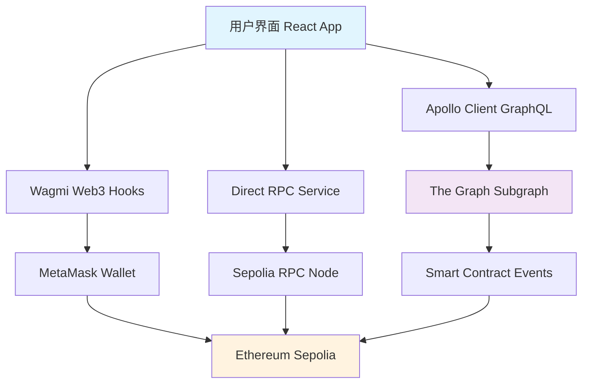

# 📊 Sepolia Subgraph 项目概述

> 🎯 本项目是一个完整的去中心化应用(DApp)教学案例，展示了现代 Web3 开发的核心技术栈

## 🌟 项目亮点

### 核心价值
- **📚 教育导向**: 每个技术组件都有详细的中文注释和学习指导
- **🔄 双数据源**: 展示直接 RPC 查询与 The Graph 索引的区别
- **🎨 现代化 UI**: 使用 React + TypeScript + Vite 构建响应式界面
- **⛓️ 完整链路**: 从智能合约到前端界面的完整数据流

### 技术特色
- **🚀 实时性**: 支持实时区块链数据查询
- **📈 可扩展**: 基于 The Graph 的可扩展索引方案
- **🛡️ 类型安全**: 全程 TypeScript 类型保护
- **🔗 钱包集成**: 完整的 Web3 钱包连接和交易功能
- **🎨 现代UI**: 卡片式布局，完整信息显示，响应式设计
- **💬 消息支持**: 转账附言功能，支持完整Unicode字符集

## 🏗️ 系统架构



## 📦 项目结构

```
sepoliaSubgraph/
├── frontend/                # 🎨 React 前端应用
│   ├── src/
│   │   ├── components/      # 🧩 React 组件
│   │   ├── hooks/          # 🪝 自定义 Hooks
│   │   ├── services/       # 🔧 业务服务
│   │   └── config/         # ⚙️ 配置文件
│   └── package.json
├── subgraph/               # 📊 The Graph 子图
│   ├── src/mapping.ts      # 📝 事件处理逻辑
│   ├── schema.graphql      # 📋 数据模型
│   └── subgraph.yaml       # ⚙️ 子图配置
├── contracts/              # 📜 智能合约
│   └── SimpleTransferContract_教学版.sol
└── docs/                   # 📚 技术文档
    ├── 01-项目概述.md
    ├── 02-环境搭建.md
    └── ...
```

## 🎯 学习目标

通过本项目，你将掌握：

### 前端开发
- ✅ React 18 + TypeScript 开发
- ✅ Vite 现代化构建工具
- ✅ Apollo Client GraphQL 数据管理
- ✅ Wagmi Web3 钱包集成
- ✅ 响应式 UI 设计

### 区块链开发
- ✅ Solidity 智能合约编写
- ✅ 事件驱动的数据索引
- ✅ The Graph 子图开发
- ✅ 以太坊 RPC 接口使用

### DevOps 和工具
- ✅ pnpm 包管理器
- ✅ ESLint 代码规范
- ✅ TypeScript 类型系统
- ✅ Git 版本控制

## 🌐 技术生态

| 技术栈 | 选择 | 说明 |
|--------|------|------|
| **前端框架** | React 18 | 最流行的前端框架，生态完善 |
| **开发语言** | TypeScript | 类型安全，开发体验好 |
| **构建工具** | Vite | 快速的开发服务器和构建工具 |
| **Web3 集成** | Wagmi | 现代化的 React Web3 Hooks |
| **数据查询** | Apollo Client | 强大的 GraphQL 客户端 |
| **区块链网络** | Sepolia 测试网 | 免费的以太坊测试环境 |
| **数据索引** | The Graph | 去中心化的区块链数据索引 |
| **智能合约** | Solidity | 以太坊智能合约开发语言 |

## 🎨 核心功能

### 1. 💰 钱包转账功能
- 多钱包支持（MetaMask、Injected）
- 实时余额查询
- ETH 转账功能
- **🆕 转账附言**: 支持中文、emoji、完整Unicode字符
- 交易状态跟踪和自动查询

### 2. 🔍 交易查询功能  
- 双数据源查询（RPC + The Graph）
- **🆕 卡片式展示**: 优雅的信息分层和可视化
- **🆕 完整信息**: 42字符地址、66字符哈希完整显示
- **🆕 颜色编码**: 发送方(红色)、接收方(绿色)直观区分
- 自动填充功能和错误处理

### 3. 📊 数据概览功能
- **🆕 响应式卡片**: 统计数据的现代化展示
- The Graph 同步状态监控
- 智能合约记录统计
- **🆕 移动端优化**: 完美的跨设备适配

### 4. 📊 智能合约集成
- 合约调用功能
- 事件监听
- 数据索引
- Gas 优化

### 4. 📈 数据可视化
- 区块信息展示
- 交易历史记录
- 账户统计信息
- 实时同步状态

## 🚀 快速开始

1. **克隆项目**
   ```bash
   git clone <repository-url>
   cd sepoliaSubgraph
   ```

2. **安装依赖**
   ```bash
   cd frontend
   pnpm install
   ```

3. **启动开发服务器**
   ```bash
   pnpm dev
   ```

4. **访问应用**
   ```
   http://localhost:5173
   ```

## 📖 学习路径

推荐按以下顺序学习文档：

1. 📖 [项目概述](./01-项目概述.md) ← 当前文档
2. 🛠️ [环境搭建](./02-环境搭建.md)
3. ⚛️ [React 前端开发](./03-React前端开发.md)  
4. 🕸️ [Web3 钱包集成](./04-Web3钱包集成.md)
5. 📊 [The Graph 数据索引](./05-TheGraph数据索引.md)
6. 📜 [智能合约开发](./06-智能合约开发.md)
7. 🔄 [数据流和架构](./07-数据流和架构.md)
8. 🚀 [部署和优化](./08-部署和优化.md)

## 💡 贡献指南

欢迎贡献代码和文档！请遵循以下原则：

- 💬 所有代码注释使用中文
- 📝 文档采用 Markdown 格式
- 🧪 提交前运行测试和 lint
- 🎯 保持代码简洁易懂

---

🎉 **准备好开始你的 Web3 开发之旅了吗？** 

👉 下一步：[环境搭建指南](./02-环境搭建.md)