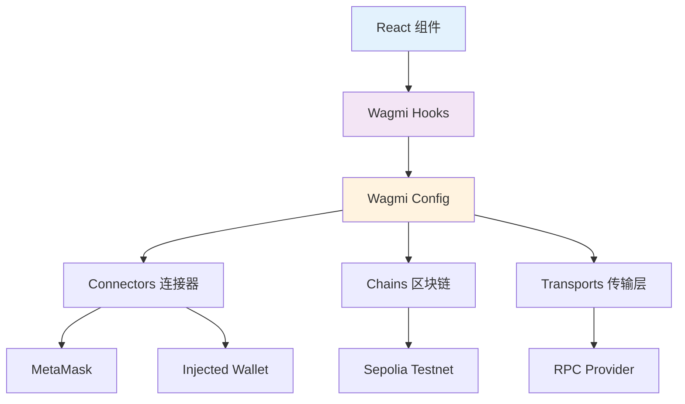

# 🕸️ Web3 钱包集成详解

> 🎯 本指南深入讲解如何使用 Wagmi + Viem 实现完整的 Web3 钱包集成功能

## 🌟 为什么选择 Wagmi?

### 传统方式 vs Wagmi
| 对比维度 | 传统 Web3.js/Ethers.js | 现代 Wagmi |
|----------|-------------------------|-------------|
| **学习曲线** | 陡峭，需要理解底层细节 | 平缓，React Hooks 风格 |
| **类型安全** | 需要手动定义类型 | 内置 TypeScript 支持 |
| **状态管理** | 手动管理连接状态 | 自动状态管理和同步 |
| **错误处理** | 复杂的错误捕获 | 统一的错误处理机制 |
| **代码量** | 大量样板代码 | 简洁的 Hook 调用 |

### Wagmi 核心优势
- 🪝 **React Hooks**: 完美融入 React 生态
- 🛡️ **类型安全**: 全程 TypeScript 类型保护  
- 🔄 **自动同步**: 状态变化自动更新UI
- 🧩 **模块化**: 按需导入，减少包体积
- 🌐 **多链支持**: 轻松切换不同区块链网络

## 🏗️ 架构设计解析

### 整体架构图


### 数据流向分析
1. **用户操作** → React 组件事件触发
2. **Hook 调用** → Wagmi Hook 处理业务逻辑
3. **配置查询** → 从 wagmiConfig 获取网络和钱包信息
4. **钱包交互** → 通过 Connector 与钱包插件通信
5. **网络请求** → Transport 层发送 RPC 请求
6. **状态更新** → Hook 返回最新状态，组件自动重渲染

## ⚙️ 配置文件深度解析

### wagmi.ts 完整配置

```typescript
/**
 * Wagmi 配置文件 - Web3 钱包连接和区块链交互配置
 * 
 * 🏗️ 配置结构说明:
 * - chains: 支持的区块链网络列表
 * - connectors: 支持的钱包连接器
 * - transports: RPC 传输配置
 */

import { createConfig, http } from 'wagmi'
import { sepolia } from 'wagmi/chains'
import { injected, metaMask } from 'wagmi/connectors'

export const wagmiConfig = createConfig({
  // 🌐 区块链网络配置
  chains: [sepolia],
  
  // 🔌 钱包连接器配置
  connectors: [
    injected(),    // 通用注入式钱包连接器
    metaMask(),    // 专用 MetaMask 连接器
  ],
  
  // 🌐 RPC 传输配置  
  transports: {
    [sepolia.id]: http('https://ethereum-sepolia-rpc.publicnode.com'),
  },
})

// 📊 导出链 ID 供其他模块使用
export const SEPOLIA_CHAIN_ID = sepolia.id;
```

### 配置详细说明

#### 1. Chains 配置
```typescript
// Sepolia 测试网配置详情
const sepolia = {
  id: 11155111,                    // 链 ID
  name: 'Sepolia',                 // 网络名称
  nativeCurrency: {                // 原生代币信息
    name: 'Sepolia Ether',
    symbol: 'ETH', 
    decimals: 18
  },
  rpcUrls: {                       // RPC 节点列表
    default: { http: ['https://sepolia.infura.io/v3/...'] },
    public: { http: ['https://ethereum-sepolia-rpc.publicnode.com'] }
  },
  blockExplorers: {                // 区块浏览器
    default: { 
      name: 'Etherscan',
      url: 'https://sepolia.etherscan.io'
    }
  }
}
```

#### 2. Connectors 连接器详解
```typescript
// 🔌 注入式钱包连接器
injected({
  // 自动检测浏览器中的钱包
  // 支持: MetaMask, Coinbase Wallet, Trust Wallet 等
})

// 🦊 专用 MetaMask 连接器
metaMask({
  // 专门为 MetaMask 优化
  // 更好的错误处理和用户体验
})

// 🌐 WalletConnect 连接器 (可选)
walletConnect({
  projectId: 'your-walletconnect-project-id',
  // 支持移动端钱包连接
})
```

#### 3. Transports 传输层配置
```typescript
// 🚀 HTTP 传输配置
http('https://ethereum-sepolia-rpc.publicnode.com', {
  // 传输配置选项
  batch: true,        // 批量请求优化
  fetchOptions: {     // Fetch 选项
    timeout: 10000,   // 超时时间
  },
  retryCount: 3,      // 重试次数
  retryDelay: 1000,   // 重试间隔
})
```

## 🪝 核心 Hooks 详解

### 1. useAccount - 账户管理

```typescript
/**
 * useAccount Hook 完整功能
 * 
 * 🔍 返回值解析:
 * - address: 当前连接的钱包地址
 * - isConnected: 连接状态布尔值
 * - isConnecting: 正在连接状态
 * - isDisconnected: 断开连接状态
 * - status: 连接状态枚举
 */

const AccountExample = () => {
  const { 
    address,           // 钱包地址 (0x...)
    isConnected,       // 是否已连接
    isConnecting,      // 正在连接中
    isDisconnected,    // 已断开连接
    status             // 详细状态: 'connecting' | 'connected' | 'disconnected'
  } = useAccount()

  // 🎯 实际应用场景
  if (isConnecting) return <div>连接钱包中...</div>
  if (isDisconnected) return <div>请连接钱包</div>
  if (isConnected) return <div>已连接: {address}</div>
}
```

### 2. useConnect - 钱包连接

```typescript
/**
 * useConnect Hook 连接管理
 * 
 * 🔗 连接流程:
 * 1. 选择连接器 (MetaMask, Injected 等)
 * 2. 调用 connect 函数
 * 3. 钱包弹出授权界面
 * 4. 用户确认连接
 * 5. 状态自动更新
 */

const ConnectExample = () => {
  const { 
    connect,           // 连接函数
    connectors,        // 可用连接器列表
    isPending,         // 连接进行中状态
    error              // 连接错误信息
  } = useConnect()

  return (
    <div>
      {connectors.map((connector) => (
        <button
          key={connector.id}
          onClick={() => connect({ connector })}
          disabled={isPending}
        >
          {isPending ? '连接中...' : `连接 ${connector.name}`}
        </button>
      ))}
      {error && <div>连接失败: {error.message}</div>}
    </div>
  )
}
```

### 3. useBalance - 余额查询

```typescript
/**
 * useBalance Hook 余额管理
 * 
 * 💰 功能特性:
 * - 自动查询指定地址余额
 * - 支持原生代币和 ERC20 代币
 * - 自动格式化数量和符号
 * - 实时更新余额变化
 */

const BalanceExample = () => {
  const { address } = useAccount()
  
  const { 
    data: balance,     // 余额数据对象
    isLoading,         // 加载状态
    error,             // 错误信息
    refetch            // 手动刷新函数
  } = useBalance({
    address: address,  // 查询地址
    // token: '0x...',  // 可选: ERC20 代币地址
    // watch: true,     // 可选: 监听余额变化
  })

  if (isLoading) return <div>查询余额中...</div>
  if (error) return <div>查询失败: {error.message}</div>

  return (
    <div>
      余额: {balance?.formatted} {balance?.symbol}
      <button onClick={() => refetch()}>刷新</button>
    </div>
  )
}
```

### 4. useSendTransaction - 交易发送

```typescript
/**
 * useSendTransaction Hook 交易管理
 * 
 * 💸 交易流程:
 * 1. 准备交易参数 (to, value, data)
 * 2. 调用 sendTransaction 函数
 * 3. 钱包弹出签名界面
 * 4. 用户确认并签名
 * 5. 交易提交到网络
 * 6. 返回交易哈希
 */

const SendTransactionExample = () => {
  const { 
    sendTransaction,   // 发送交易函数
    data: txHash,      // 交易哈希
    isPending,         // 交易提交中
    error              // 交易错误
  } = useSendTransaction()

  const handleSend = async () => {
    try {
      await sendTransaction({
        to: '0x...',                    // 接收地址
        value: parseEther('0.1'),       // 转账金额 (Wei)
        // data: '0x...',               // 可选: 交易数据
        // gas: 21000n,                 // 可选: Gas 限制
        // gasPrice: parseGwei('10'),   // 可选: Gas 价格
      })
    } catch (error) {
      console.error('交易失败:', error)
    }
  }

  return (
    <div>
      <button onClick={handleSend} disabled={isPending}>
        {isPending ? '发送中...' : '发送交易'}
      </button>
      {txHash && <div>交易哈希: {txHash}</div>}
      {error && <div>交易失败: {error.message}</div>}
    </div>
  )
}
```

### 5. useWaitForTransactionReceipt - 交易确认

```typescript
/**
 * useWaitForTransactionReceipt Hook 交易确认
 * 
 * ⏳ 确认流程:
 * 1. 交易提交到内存池
 * 2. 矿工打包到区块
 * 3. 区块被网络确认
 * 4. Hook 返回交易收据
 */

const TransactionReceiptExample = () => {
  const [txHash, setTxHash] = useState('')
  
  const { 
    data: receipt,     // 交易收据
    isLoading,         // 等待确认中
    isSuccess,         // 交易成功
    error              // 交易失败
  } = useWaitForTransactionReceipt({
    hash: txHash as `0x${string}`,
    // confirmations: 1,  // 可选: 确认数量
    // timeout: 60_000,   // 可选: 超时时间
  })

  if (isLoading) return <div>等待交易确认...</div>
  if (error) return <div>交易失败: {error.message}</div>
  if (isSuccess) return <div>交易成功！Gas 使用: {receipt?.gasUsed.toString()}</div>

  return null
}
```

## 🎨 组件集成实践

### WalletTransfer 组件深度分析

```typescript
/**
 * WalletTransfer 组件架构分析
 * 
 * 🏗️ 组件结构:
 * WalletTransfer
 * ├── 连接状态管理
 * ├── 余额查询显示  
 * ├── 转账表单处理
 * ├── 交易状态跟踪
 * └── 错误处理展示
 */

const WalletTransfer = ({ onTransactionSuccess }) => {
  // 🔗 钱包连接状态
  const { address, isConnected } = useAccount()
  const { connect, connectors } = useConnect()
  const { disconnect } = useDisconnect()
  
  // 💰 余额查询
  const { data: balance, isLoading: isLoadingBalance } = useBalance({
    address: address,
  })
  
  // 💸 交易发送
  const { 
    sendTransaction, 
    data: txHash, 
    isPending: isTxPending, 
    error: txError 
  } = useSendTransaction()
  
  // ⏳ 交易确认
  const { 
    isLoading: isConfirming, 
    isSuccess: isConfirmed,
    error: receiptError
  } = useWaitForTransactionReceipt({
    hash: txHash,
  })

  // 🎯 核心转账逻辑
  const handleTransfer = async () => {
    if (!toAddress || !amount || !address) return

    try {
      await sendTransaction({
        to: toAddress as `0x${string}`,
        value: parseEther(amount),
      })
    } catch (error) {
      console.error('Transfer error:', error)
    }
  }

  // ✅ 成功处理副作用
  useEffect(() => {
    if (isConfirmed && txHash) {
      onTransactionSuccess?.(txHash)  // 通知父组件
      // 重置表单状态
    }
  }, [isConfirmed, txHash, onTransactionSuccess])

  // 🎨 UI 渲染逻辑
  return (
    <div>
      {/* 钱包连接区域 */}
      {!isConnected ? (
        <ConnectWalletSection />
      ) : (
        <ConnectedWalletInfo />
      )}
      
      {/* 转账表单区域 */}
      {isConnected && (
        <TransferFormSection />
      )}
    </div>
  )
}
```

## 🛡️ 错误处理最佳实践

### 常见错误类型和处理

```typescript
/**
 * Web3 错误处理完整指南
 * 
 * 🚨 常见错误类型:
 * - 用户拒绝: User denied transaction signature
 * - 余额不足: Insufficient funds
 * - Gas 估算失败: Cannot estimate gas
 * - 网络错误: Network connection failed
 */

const ErrorHandlingExample = () => {
  const handleError = (error: Error) => {
    // 🔍 错误类型识别
    if (error.message.includes('User denied')) {
      showNotification('用户取消了交易', 'warning')
    } else if (error.message.includes('insufficient funds')) {
      showNotification('账户余额不足', 'error')
    } else if (error.message.includes('gas')) {
      showNotification('Gas 费用估算失败，请检查交易参数', 'error')
    } else {
      showNotification(`交易失败: ${error.message}`, 'error')
    }
    
    // 📊 错误统计上报
    reportError('transaction_error', {
      message: error.message,
      stack: error.stack,
      timestamp: new Date().toISOString()
    })
  }

  return (
    // UI 组件
  )
}
```

### 网络切换处理

```typescript
/**
 * 网络切换处理
 * 
 * 🌐 处理场景:
 * - 用户在错误网络
 * - 需要切换到 Sepolia
 * - 自动切换失败时的提示
 */

const NetworkSwitchExample = () => {
  const { chain } = useAccount()
  const { switchChain } = useSwitchChain()

  useEffect(() => {
    if (chain && chain.id !== SEPOLIA_CHAIN_ID) {
      // 🔄 尝试自动切换网络
      switchChain({ chainId: SEPOLIA_CHAIN_ID })
        .catch(() => {
          // 切换失败时的用户提示
          showNotification('请手动切换到 Sepolia 测试网', 'warning')
        })
    }
  }, [chain, switchChain])

  if (chain?.id !== SEPOLIA_CHAIN_ID) {
    return (
      <div className="network-warning">
        ⚠️ 请切换到 Sepolia 测试网
        <button onClick={() => switchChain({ chainId: SEPOLIA_CHAIN_ID })}>
          切换网络
        </button>
      </div>
    )
  }

  return <div>网络正确 ✅</div>
}
```

## 🔒 安全考虑

### 1. 地址验证
```typescript
/**
 * 以太坊地址验证
 */
const isValidAddress = (address: string): boolean => {
  // 基础格式验证
  if (!/^0x[a-fA-F0-9]{40}$/.test(address)) {
    return false
  }
  
  // 校验和验证 (EIP-55)
  try {
    return getAddress(address) === address
  } catch {
    return false
  }
}
```

### 2. 金额验证
```typescript
/**
 * 转账金额安全验证
 */
const validateTransferAmount = (
  amount: string, 
  balance: bigint,
  maxAllowed: bigint = parseEther('10') // 单次最大转账限制
): string | null => {
  try {
    const amountWei = parseEther(amount)
    
    if (amountWei <= 0n) {
      return '转账金额必须大于 0'
    }
    
    if (amountWei > balance) {
      return '余额不足'
    }
    
    if (amountWei > maxAllowed) {
      return '单次转账金额过大'
    }
    
    return null // 验证通过
  } catch {
    return '金额格式错误'
  }
}
```

### 3. 交易监控
```typescript
/**
 * 交易状态监控
 */
const useTransactionMonitor = (txHash: string) => {
  const [status, setStatus] = useState<'pending' | 'success' | 'failed'>('pending')
  
  useEffect(() => {
    if (!txHash) return
    
    // 监控交易状态变化
    const monitorTransaction = async () => {
      try {
        const receipt = await waitForTransactionReceipt({
          hash: txHash,
          timeout: 300_000, // 5 分钟超时
        })
        
        setStatus(receipt.status === 'success' ? 'success' : 'failed')
      } catch (error) {
        console.error('Transaction monitoring failed:', error)
        setStatus('failed')
      }
    }
    
    monitorTransaction()
  }, [txHash])
  
  return status
}
```

## 📊 性能优化策略

### 1. 连接状态缓存
```typescript
/**
 * 连接状态持久化
 */
const usePersistedConnection = () => {
  const { isConnected } = useAccount()
  
  useEffect(() => {
    // 保存连接状态到本地存储
    localStorage.setItem('wallet_connected', isConnected.toString())
  }, [isConnected])
  
  // 页面加载时恢复连接状态
  useEffect(() => {
    const wasConnected = localStorage.getItem('wallet_connected') === 'true'
    if (wasConnected && !isConnected) {
      // 尝试自动重连
      reconnect()
    }
  }, [])
}
```

### 2. 批量查询优化
```typescript
/**
 * 批量余额查询
 */
const useMultipleBalances = (addresses: string[]) => {
  return useQuery({
    queryKey: ['balances', addresses],
    queryFn: async () => {
      // 使用 multicall 批量查询余额
      const results = await readContracts({
        contracts: addresses.map(address => ({
          address: '0x...', // 原生代币或代币合约地址
          abi: balanceAbi,
          functionName: 'balanceOf',
          args: [address],
        })),
      })
      return results
    },
    staleTime: 30_000, // 30秒缓存
  })
}
```

## 🧪 测试策略

### 1. Hook 测试
```typescript
/**
 * Wagmi Hook 测试示例
 */
import { renderHook, waitFor } from '@testing-library/react'
import { useAccount } from 'wagmi'

const wrapper = ({ children }) => (
  <WagmiProvider config={testConfig}>
    {children}
  </WagmiProvider>
)

test('useAccount returns connected status', async () => {
  const { result } = renderHook(() => useAccount(), { wrapper })
  
  await waitFor(() => {
    expect(result.current.isConnected).toBe(true)
  })
})
```

### 2. 组件集成测试
```typescript
/**
 * 钱包组件集成测试
 */
import { render, screen, fireEvent } from '@testing-library/react'
import WalletTransfer from './WalletTransfer'

test('displays connect button when wallet not connected', () => {
  render(<WalletTransfer />)
  
  expect(screen.getByText('连接钱包')).toBeInTheDocument()
})

test('shows transfer form when wallet connected', async () => {
  // Mock connected wallet
  mockUseAccount.mockReturnValue({
    isConnected: true,
    address: '0x123...'
  })
  
  render(<WalletTransfer />)
  
  expect(screen.getByText('发送 ETH')).toBeInTheDocument()
})
```

## 🚀 部署配置

### 1. 环境变量
```typescript
// .env.production
VITE_WALLETCONNECT_PROJECT_ID=your_project_id
VITE_RPC_URL=https://ethereum-sepolia-rpc.publicnode.com
VITE_ENABLE_TESTNET=false
```

### 2. 构建优化
```typescript
// vite.config.ts
export default defineConfig({
  build: {
    rollupOptions: {
      output: {
        manualChunks: {
          'wagmi': ['wagmi', 'viem'],
          'wallet': ['@rainbow-me/rainbowkit'],
        }
      }
    }
  }
})
```

## 📋 开发检查清单

### 功能完整性
- [ ] 钱包连接/断开功能正常
- [ ] 支持多种钱包类型 (MetaMask, Injected)
- [ ] 余额查询实时更新
- [ ] 转账功能完整流程
- [ ] 交易状态正确跟踪
- [ ] 错误处理覆盖全面

### 用户体验
- [ ] 连接状态清晰显示
- [ ] 加载状态友好提示
- [ ] 错误信息用户可理解
- [ ] 交易进度实时反馈
- [ ] 表单验证及时准确
- [ ] 响应式设计适配移动端

### 安全性
- [ ] 地址格式严格验证
- [ ] 转账金额安全检查
- [ ] 网络切换正确处理
- [ ] 敏感信息不在客户端存储
- [ ] 交易参数二次确认

---

🎉 **恭喜！** 你现在已经掌握了完整的 Web3 钱包集成技术！

👉 **下一步**: [The Graph 数据索引详解](./05-TheGraph数据索引.md)

💡 **实践建议**: 建议在 MetaMask 中创建一个测试账户，获取一些测试 ETH，然后实际操作每个功能，这样能更深入理解整个流程！