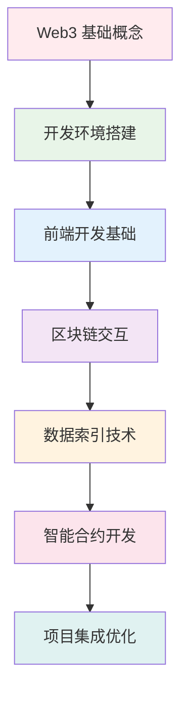

# 🎓 完整学习流程指南

> 🎯 本指南为初学者提供了系统性的 Web3 全栈开发学习路径，从基础概念到实际项目开发

## 📖 学习路径总览

### 🌟 学习目标设定
通过本项目的学习，你将获得：
- ✅ **Web3 全栈开发技能** - 从智能合约到前端应用
- ✅ **现代化开发工具掌握** - React、TypeScript、Vite 等
- ✅ **区块链核心概念理解** - 交易、事件、索引等
- ✅ **实际项目开发经验** - 完整的 DApp 开发流程

### 📚 知识体系结构


## 🚀 第一阶段：基础知识准备 (1-2 周)

### Week 1: Web3 基础概念学习

#### 📝 核心概念清单
1. **区块链基础**
   - [ ] 什么是区块链？去中心化的特点
   - [ ] 区块、交易、哈希的概念
   - [ ] 以太坊网络结构和工作原理
   - [ ] Gas 费用机制理解

2. **钱包和账户**
   - [ ] 私钥、公钥、地址的关系
   - [ ] MetaMask 钱包的安装和使用
   - [ ] 测试网络的概念和使用
   - [ ] 助记词的重要性和安全性

3. **智能合约基础**
   - [ ] 智能合约的概念和特点
   - [ ] Solidity 语言基础语法
   - [ ] 合约的部署和调用
   - [ ] 事件(Event)的概念和作用

#### 📖 推荐学习资源
- **入门教程**: [以太坊官方文档](https://ethereum.org/zh/)
- **视频课程**: Solidity 基础教程
- **实践工具**: [Remix IDE](https://remix.ethereum.org/)
- **测试网络**: Sepolia 测试网使用指南

#### ✅ 第一周学习检验
完成以下任务证明你已掌握基础概念：
- [ ] 成功安装并配置 MetaMask 钱包
- [ ] 获取 Sepolia 测试网的测试 ETH
- [ ] 在 Remix 中部署一个简单的合约
- [ ] 理解交易哈希、区块号等基础概念

### Week 2: 开发环境搭建

按照 [环境搭建指南](./02-环境搭建.md) 完成所有环境配置：

#### 🛠️ 环境搭建检查清单
- [ ] Node.js (≥18.0) 安装和验证
- [ ] pnpm 包管理器安装
- [ ] VS Code 编辑器配置
- [ ] Git 版本控制配置
- [ ] MetaMask 钱包配置
- [ ] Sepolia 测试网配置
- [ ] 项目克隆和依赖安装

#### 🎯 实践任务
1. **项目启动验证**
   ```bash
   cd frontend
   pnpm install
   pnpm dev
   ```
   访问 http://localhost:5173 确保项目正常运行

2. **钱包连接测试**
   - 在应用中连接 MetaMask
   - 查看余额显示
   - 测试网络切换功能

## 🔧 第二阶段：前端开发实战 (2-3 周)

### Week 3-4: React + TypeScript 基础

#### 📚 技术栈学习重点
1. **React 18 新特性**
   - [ ] 函数组件和 Hooks 的使用
   - [ ] useEffect 副作用管理
   - [ ] useState 状态管理
   - [ ] 组件间通信模式

2. **TypeScript 应用**
   - [ ] 接口(Interface)定义
   - [ ] 类型安全的函数组件
   - [ ] 泛型的使用场景
   - [ ] 模块导入导出

3. **现代化开发工具**
   - [ ] Vite 构建工具的优势
   - [ ] ESLint 代码规范
   - [ ] pnpm 包管理器特点
   - [ ] 热更新和开发体验

#### 🎯 实践项目：组件分析
详细分析项目中的核心组件：

1. **WalletTransfer 组件**
   ```typescript
   // 学习目标：理解 Web3 钱包集成
   - Wagmi Hooks 的使用模式
   - 表单状态管理
   - 异步操作处理
   - 错误边界和用户反馈
   ```

2. **TransactionQuery 组件**
   ```typescript
   // 学习目标：掌握数据获取和显示
   - 双数据源对比设计
   - 条件渲染逻辑
   - 数据格式化处理
   - 用户交互优化
   ```

#### 📝 实践任务
1. **代码理解任务**
   - [ ] 阅读每个组件的详细注释
   - [ ] 理解数据流向和状态管理
   - [ ] 分析错误处理机制
   - [ ] 掌握 TypeScript 类型定义

2. **小型修改任务**
   - [ ] 修改 UI 样式和布局
   - [ ] 添加新的验证规则
   - [ ] 优化用户交互体验
   - [ ] 添加新的状态显示

### Week 5: Web3 集成深入

#### 🔗 Wagmi + Viem 技术栈
按照 [Web3 钱包集成详解](./04-Web3钱包集成.md) 深入学习：

1. **Wagmi 配置理解**
   ```typescript
   // 学习重点
   - wagmiConfig 配置详解
   - chains、connectors、transports 的作用
   - 如何添加新的网络和钱包
   ```

2. **核心 Hooks 掌握**
   - [ ] `useAccount` - 账户状态管理
   - [ ] `useConnect` - 钱包连接管理  
   - [ ] `useBalance` - 余额查询
   - [ ] `useSendTransaction` - 交易发送
   - [ ] `useWaitForTransactionReceipt` - 交易确认

#### 🎯 进阶实践
1. **功能增强任务**
   - [ ] 添加交易历史记录显示
   - [ ] 实现批量转账功能
   - [ ] 增加交易费用估算
   - [ ] 优化移动端适配

2. **安全性改进**
   - [ ] 添加地址簿功能
   - [ ] 实现转账限额设置
   - [ ] 增强错误提示信息
   - [ ] 添加交易确认二次验证

## 📊 第三阶段：数据索引和查询 (2 周)

### Week 6-7: The Graph 技术深入

#### 🏗️ The Graph 核心概念
1. **子图(Subgraph)架构**
   ```yaml
   # 学习重点：subgraph.yaml 配置
   - 数据源配置
   - 实体映射定义
   - 事件处理器绑定
   ```

2. **数据建模**
   ```graphql
   # 学习重点：schema.graphql 设计
   - 实体(Entity)定义
   - 关系(Relationship)建立
   - 字段类型选择
   ```

3. **映射逻辑**
   ```typescript
   // 学习重点：mapping.ts 事件处理
   - 事件监听和处理
   - 实体的创建和更新
   - 关系数据的维护
   ```

#### 📈 GraphQL 查询技能
1. **基础查询语法**
   ```graphql
   # 单个实体查询
   query GetTransaction($hash: Bytes!) {
     transaction(id: $hash) {
       id
       hash
       value
       timestamp
     }
   }
   ```

2. **复杂查询模式**
   ```graphql
   # 关联查询和筛选
   query GetTransactions($first: Int, $where: Transaction_filter) {
     transactions(first: $first, where: $where, orderBy: timestamp, orderDirection: desc) {
       id
       from { address }
       to { address }
       value
     }
   }
   ```

#### 🎯 实践任务
1. **子图开发**
   - [ ] 理解现有子图的结构
   - [ ] 修改数据模型添加新字段
   - [ ] 编写新的事件处理逻辑
   - [ ] 测试子图的同步和查询

2. **前端集成**
   - [ ] 使用 Apollo Client 进行 GraphQL 查询
   - [ ] 实现数据缓存和刷新策略
   - [ ] 添加查询加载和错误状态
   - [ ] 对比 RPC 和 Graph 查询的性能

## 📜 第四阶段：智能合约开发 (2-3 周)

### Week 8-9: Solidity 智能合约

#### 🔥 Solidity 语言深入
1. **语言基础强化**
   ```solidity
   // 学习重点
   - 数据类型和存储位置
   - 修饰符(modifier)的使用
   - 事件(event)的设计
   - 错误处理机制
   ```

2. **合约设计模式**
   ```solidity
   // 学习目标
   - 访问控制模式
   - 状态机模式
   - 工厂模式应用
   - 代理模式理解
   ```

3. **Gas 优化技巧**
   ```solidity
   // 优化技术
   - 存储布局优化
   - 批量操作设计
   - 事件替代存储
   - 自定义错误使用
   ```

#### 🎯 合约开发实践
1. **分析现有合约**
   ```solidity
   // SimpleTransferContract_教学版.sol 分析
   - 理解每行代码的作用
   - 掌握事件的触发机制
   - 学习错误处理的最佳实践
   - 理解 Gas 优化技巧
   ```

2. **功能扩展开发**
   - [ ] 添加转账限额功能
   - [ ] 实现多签名转账
   - [ ] 增加暂停/恢复功能
   - [ ] 添加手续费收取机制

### Week 10: 合约测试和部署

#### 🧪 合约测试
1. **单元测试编写**
   ```javascript
   // Hardhat 测试框架
   - 测试用例设计
   - Mock 数据准备
   - 异常情况测试
   - Gas 消耗测试
   ```

2. **集成测试**
   - [ ] 前端与合约的集成测试
   - [ ] 事件监听功能测试
   - [ ] 用户交互流程测试

#### 🚀 部署和验证
1. **测试网部署**
   - [ ] 使用 Hardhat 部署到 Sepolia
   - [ ] 合约验证和源码公开
   - [ ] 前端配置新合约地址

2. **监控和维护**
   - [ ] 合约事件监控
   - [ ] 异常交易排查
   - [ ] 性能优化调整

## 🔄 第五阶段：系统集成优化 (1-2 周)

### Week 11-12: 全栈集成

#### 🌐 系统架构优化
1. **数据流优化**
   ```typescript
   // 优化目标
   - RPC 查询性能提升
   - GraphQL 缓存策略
   - 状态管理优化
   - 错误恢复机制
   ```

2. **用户体验提升**
   - [ ] 加载状态优化
   - [ ] 错误提示改进
   - [ ] 响应式设计完善
   - [ ] 无障碍访问支持

#### 🎨 高级功能开发
1. **数据可视化**
   - [ ] 交易统计图表
   - [ ] 实时数据面板
   - [ ] 历史趋势分析

2. **高级交互功能**
   - [ ] 批量操作界面
   - [ ] 交易队列管理
   - [ ] 自动化执行脚本

#### ⚡ 性能优化
1. **前端优化**
   ```typescript
   // 优化策略
   - 代码分割和懒加载
   - 组件缓存机制
   - 网络请求优化
   - 内存泄漏防护
   ```

2. **数据查询优化**
   - [ ] 查询去重和合并
   - [ ] 缓存策略调优
   - [ ] 错误重试机制
   - [ ] 超时处理优化

## 📊 学习成果评估

### 🎯 技能评估清单

#### 前端开发技能 (React + TypeScript)
- [ ] **组件开发** (90%+): 能够独立开发复杂的 React 组件
- [ ] **状态管理** (85%+): 熟练使用 Hooks 管理组件状态
- [ ] **类型安全** (80%+): 合理使用 TypeScript 确保代码质量
- [ ] **用户体验** (85%+): 关注加载、错误处理等用户体验细节

#### Web3 集成技能 (Wagmi + Viem)
- [ ] **钱包集成** (90%+): 掌握各种钱包连接方式
- [ ] **交易处理** (85%+): 熟练处理区块链交易全流程
- [ ] **数据查询** (80%+): 能够高效查询区块链数据
- [ ] **错误处理** (85%+): 妥善处理各种 Web3 异常情况

#### 数据索引技能 (The Graph)
- [ ] **子图开发** (75%+): 能够设计和实现数据索引逻辑
- [ ] **GraphQL** (80%+): 熟练编写复杂的 GraphQL 查询
- [ ] **数据建模** (75%+): 合理设计实体关系模型
- [ ] **性能优化** (70%+): 了解查询优化和缓存策略

#### 智能合约技能 (Solidity)
- [ ] **语言基础** (80%+): 熟练使用 Solidity 语法特性
- [ ] **合约设计** (75%+): 能够设计安全可靠的智能合约
- [ ] **Gas 优化** (70%+): 了解并应用 Gas 优化技巧
- [ ] **测试部署** (75%+): 掌握合约测试和部署流程

### 🏆 项目成果展示

#### 必须完成的项目功能
- [ ] **完整的钱包连接功能** - 支持多钱包，状态管理完善
- [ ] **双数据源查询对比** - RPC 和 The Graph 性能对比
- [ ] **智能合约交互** - 合约调用和事件监听
- [ ] **响应式 UI 界面** - 适配桌面和移动设备

#### 加分项目扩展
- [ ] **交易批处理功能** - 批量转账和状态管理
- [ ] **数据可视化面板** - 图表展示交易统计
- [ ] **高级安全功能** - 多重签名、限额控制等
- [ ] **性能监控面板** - 实时监控系统性能指标

## 🔄 持续学习路径

### 📚 进阶学习方向

#### 1. DeFi 协议开发
- **Uniswap** 类似的 AMM 协议
- **Lending** 借贷协议设计
- **Yield Farming** 流动性挖矿机制
- **DAO** 治理协议开发

#### 2. NFT 和游戏开发
- **ERC-721/1155** 标准深入
- **元数据存储** IPFS 集成
- **游戏经济模型** 设计
- **跨链资产** 桥接技术

#### 3. Layer2 和扩容方案
- **Arbitrum/Optimism** Layer2 部署
- **Polygon** 侧链开发
- **zkSync** 零知识证明技术
- **跨链桥** 开发和安全

#### 4. 企业级应用开发
- **供应链金融** 区块链溯源
- **数字身份** 认证系统
- **碳交易** 平台开发
- **数据隐私** 保护方案

### 🌐 社区参与和贡献

#### 开源项目贡献
- [ ] 为知名 Web3 项目贡献代码
- [ ] 参与技术标准制定
- [ ] 编写技术博客和教程
- [ ] 参加黑客松活动

#### 社区建设
- [ ] 加入 Web3 开发者社区
- [ ] 参与技术讨论和分享
- [ ] 导师其他初学者
- [ ] 组织技术聚会和工作坊

## 💡 学习心得和建议

### 📝 学习方法建议
1. **理论与实践结合** - 不要只看不动手
2. **从错误中学习** - 错误是最好的老师
3. **社区互助学习** - 和其他开发者交流
4. **持续关注更新** - Web3 技术发展很快
5. **注重安全意识** - 安全是 Web3 的重中之重

### 🚀 职业发展路径
- **初级 Web3 开发者** (3-6个月): 掌握基础技能
- **中级全栈开发者** (6-12个月): 独立开发完整项目
- **高级架构师** (1-2年): 设计复杂系统架构
- **技术专家/创业者** (2年+): 引领技术创新

---

🎉 **恭喜你完成了完整的学习流程规划！**

记住，学习是一个渐进的过程，不要着急，按照自己的节奏稳步前进。每完成一个阶段，都要回过头来巩固和总结，这样才能建立扎实的技术基础。

💪 **现在就开始你的 Web3 开发之旅吧！**