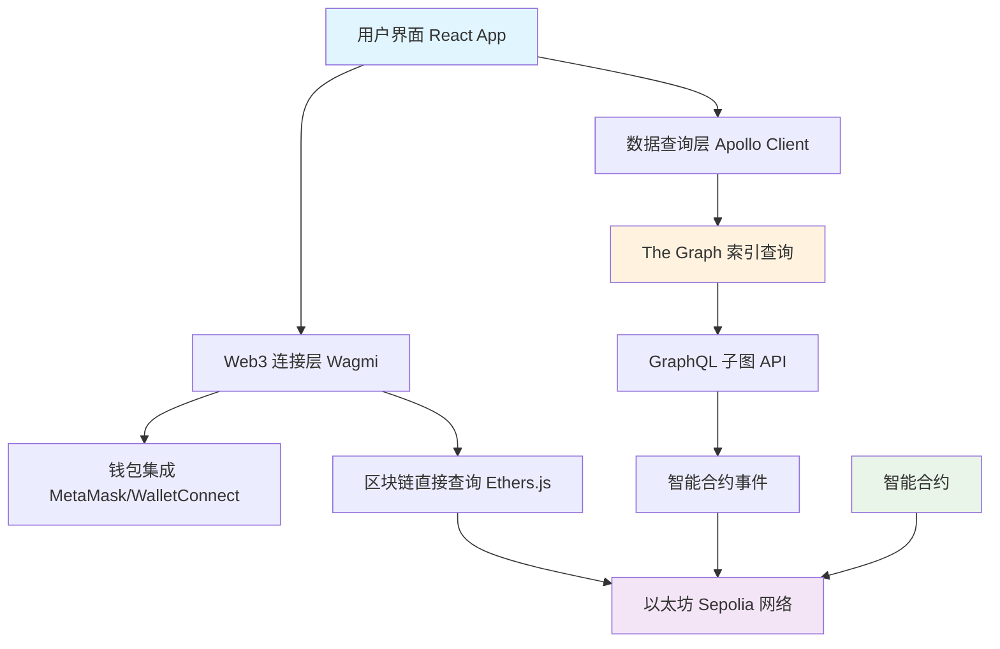

# 🏗️ 技术架构详解

> 🎯 **深度解析**：全面剖析项目的技术架构、设计理念和实现细节

## 📋 架构概览

本项目是一个完整的 Web3 数据查询系统，展示了现代去中心化应用的技术架构：



---

## 🔧 第一部分：前端架构

### 1.1 技术栈选择理由

| 技术 | 版本 | 选择理由 | 替代方案 |
|------|------|----------|----------|
| **React** | 19.1.1 | 成熟生态、组件化、hooks | Vue.js, Angular |
| **TypeScript** | 5.8.3 | 类型安全、开发效率 | JavaScript |
| **Vite** | 7.1.2 | 快速构建、热更新 | Webpack, Parcel |
| **Wagmi** | 2.16.4 | Web3 React hooks | Web3React |
| **Ethers.js** | 6.15.0 | 以太坊交互库 | Web3.js |

### 1.2 组件架构设计

```typescript
// 组件层级架构
App (根组件)
├── ErrorBoundary (错误边界)
├── Header (导航头)
└── TabContainer (标签页容器)
    ├── TransactionQuery (交易查询)
    │   ├── QueryForm (查询表单)
    │   ├── DataSourceSelector (数据源选择)
    │   └── ResultDisplay (结果展示)
    ├── AddressQuery (地址查询)
    │   ├── AddressInput (地址输入)
    │   └── TransactionList (交易列表)
    ├── WalletTransfer (钱包转账)
    │   ├── WalletConnector (钱包连接)
    │   ├── TransferForm (转账表单)
    │   └── TransactionStatus (交易状态)
    └── TransactionList (数据概览)
        ├── StatsDisplay (统计展示)
        └── RecentTransactions (最近交易)
```

### 1.3 状态管理策略

```typescript
// hooks/useTransactionQuery.ts - 数据状态管理
interface TransactionState {
  data: Transaction[] | null;
  loading: boolean;
  error: ApolloError | null;
  refetch: () => void;
}

// 状态管理模式：
// 1. 本地状态：useState (简单UI状态)
// 2. 服务器状态：Apollo Client + React Query (远程数据)
// 3. Web3状态：Wagmi (钱包和区块链状态)

export const useTransactionQuery = (hash: string): TransactionState => {
  const { data, loading, error, refetch } = useQuery<TransactionData>(
    GET_TRANSACTION,
    {
      variables: { hash },
      skip: !hash,
      errorPolicy: 'all', // 显示部分数据即使有错误
      fetchPolicy: 'cache-and-network' // 缓存优先，后台更新
    }
  );

  return {
    data: data?.transaction ? [data.transaction] : null,
    loading,
    error,
    refetch
  };
};
```

### 1.4 性能优化策略

```typescript
// 1. 组件懒加载
const TransactionQuery = lazy(() => import('./components/TransactionQuery'));
const AddressQuery = lazy(() => import('./components/AddressQuery'));

// 2. memo 优化渲染
const TransactionList = memo(({ transactions }: Props) => {
  return (
    <div>
      {transactions.map(tx => (
        <TransactionItem key={tx.id} transaction={tx} />
      ))}
    </div>
  );
});

// 3. useMemo 缓存计算结果
const expensiveValue = useMemo(() => {
  return transactions.reduce((sum, tx) => sum + Number(tx.value), 0);
}, [transactions]);

// 4. useCallback 缓存函数引用
const handleTransactionClick = useCallback((txHash: string) => {
  onTransactionSelect(txHash);
}, [onTransactionSelect]);
```

---

## 🌐 第二部分：Web3 集成架构

### 2.1 Wagmi 配置详解

```typescript
// config/wagmi.ts
import { createConfig, http } from 'wagmi';
import { sepolia } from 'wagmi/chains';
import { metaMask, walletConnect } from 'wagmi/connectors';

const projectId = 'your-walletconnect-project-id';

export const wagmiConfig = createConfig({
  chains: [sepolia],
  connectors: [
    metaMask(), // MetaMask 连接器
    walletConnect({ 
      projectId,
      metadata: {
        name: 'Sepolia Transaction Explorer',
        description: 'Web3 Data Query System',
        url: 'https://your-domain.com',
        icons: ['https://your-domain.com/icon.png']
      }
    })
  ],
  transports: {
    [sepolia.id]: http('https://rpc.sepolia.org')
  },
  // 全局配置
  ssr: false, // 客户端渲染
  storage: createStorage({
    storage: localStorage, // 持久化连接状态
  })
});

// Provider 包装
function App() {
  return (
    <WagmiProvider config={wagmiConfig}>
      <QueryClientProvider client={queryClient}>
        {/* 应用内容 */}
      </QueryClientProvider>
    </WagmiProvider>
  );
}
```

### 2.2 多钱包支持架构

```typescript
// hooks/useWalletConnection.ts
export const useWalletConnection = () => {
  const { connect, connectors } = useConnect();
  const { disconnect } = useDisconnect();
  const { address, isConnected } = useAccount();

  const connectWallet = useCallback(async (connectorType: 'metamask' | 'walletconnect') => {
    const connector = connectors.find(c => 
      connectorType === 'metamask' ? c.name === 'MetaMask' :
      connectorType === 'walletconnect' ? c.name === 'WalletConnect' :
      false
    );

    if (connector) {
      try {
        await connect({ connector });
      } catch (error) {
        console.error('钱包连接失败:', error);
        throw error;
      }
    }
  }, [connect, connectors]);

  return {
    address,
    isConnected,
    connectWallet,
    disconnect,
    supportedWallets: ['metamask', 'walletconnect']
  };
};
```

### 2.3 交易处理流程

```typescript
// services/transactionService.ts
export class TransactionService {
  
  // 发送ETH转账
  static async sendEthTransfer(
    to: string, 
    amount: string, 
    signer: ethers.Signer
  ): Promise<TransactionResponse> {
    try {
      // 1. 验证地址格式
      if (!ethers.utils.isAddress(to)) {
        throw new Error('无效的接收地址');
      }

      // 2. 验证金额
      const value = ethers.utils.parseEther(amount);
      if (value.lte(0)) {
        throw new Error('转账金额必须大于0');
      }

      // 3. 检查余额
      const balance = await signer.getBalance();
      const gasEstimate = await signer.estimateGas({
        to,
        value
      });
      
      const gasPrice = await signer.getGasPrice();
      const totalCost = value.add(gasEstimate.mul(gasPrice));
      
      if (balance.lt(totalCost)) {
        throw new Error('余额不足以完成转账');
      }

      // 4. 发送交易
      const tx = await signer.sendTransaction({
        to,
        value,
        gasLimit: gasEstimate.add(21000) // 添加缓冲
      });

      return tx;
    } catch (error) {
      console.error('转账失败:', error);
      throw error;
    }
  }

  // 调用智能合约
  static async callContract(
    contract: ethers.Contract,
    methodName: string,
    args: any[],
    options: { value?: string; gasLimit?: number } = {}
  ): Promise<TransactionResponse> {
    try {
      const method = contract[methodName];
      if (!method) {
        throw new Error(`合约方法 ${methodName} 不存在`);
      }

      const tx = await method(...args, {
        value: options.value ? ethers.utils.parseEther(options.value) : 0,
        gasLimit: options.gasLimit || 200000
      });

      return tx;
    } catch (error) {
      console.error('合约调用失败:', error);
      throw error;
    }
  }
}
```

---

## 📊 第三部分：数据层架构

### 3.1 双数据源设计

项目采用双数据源架构：

```typescript
// services/dataSourceManager.ts
export enum DataSource {
  RPC = 'rpc',
  GRAPH = 'graph'
}

export class DataSourceManager {
  private rpcService: EthereumService;
  private graphService: ApolloClient<NormalizedCacheObject>;

  constructor() {
    this.rpcService = new EthereumService();
    this.graphService = apolloClient;
  }

  // 智能数据源选择
  async getTransaction(hash: string, preferredSource?: DataSource) {
    switch (preferredSource) {
      case DataSource.RPC:
        return this.getTransactionFromRPC(hash);
      
      case DataSource.GRAPH:
        return this.getTransactionFromGraph(hash);
      
      default:
        // 自动选择最佳数据源
        return this.getTransactionAuto(hash);
    }
  }

  private async getTransactionAuto(hash: string) {
    try {
      // 首先尝试 The Graph (更快)
      const graphResult = await this.getTransactionFromGraph(hash);
      if (graphResult) {
        return { ...graphResult, source: DataSource.GRAPH };
      }
    } catch (error) {
      console.warn('Graph查询失败，降级到RPC:', error);
    }

    // 降级到 RPC 查询
    const rpcResult = await this.getTransactionFromRPC(hash);
    return { ...rpcResult, source: DataSource.RPC };
  }
}
```

### 3.2 RPC 服务架构

```typescript
// services/ethereumService.ts
export class EthereumService {
  private providers: ethers.JsonRpcProvider[];
  private currentProviderIndex: number = 0;

  constructor() {
    // 多RPC节点容错
    this.providers = SEPOLIA_RPC_URLS.map(url => 
      new ethers.JsonRpcProvider(url, {
        name: 'sepolia',
        chainId: 11155111
      })
    );
  }

  // 故障转移机制
  private async tryProviders<T>(
    operation: (provider: ethers.JsonRpcProvider) => Promise<T>
  ): Promise<T> {
    let lastError: Error | null = null;
    
    for (let i = 0; i < this.providers.length; i++) {
      const providerIndex = (this.currentProviderIndex + i) % this.providers.length;
      const provider = this.providers[providerIndex];
      
      try {
        // 10秒超时控制
        const result = await Promise.race([
          operation(provider),
          new Promise<never>((_, reject) => 
            setTimeout(() => reject(new Error('Request timeout')), 10000)
          )
        ]);
        
        // 成功时更新首选提供商
        this.currentProviderIndex = providerIndex;
        return result;
      } catch (error) {
        console.warn(`RPC节点 ${SEPOLIA_RPC_URLS[providerIndex]} 失败:`, error);
        lastError = error instanceof Error ? error : new Error(String(error));
      }
    }
    
    throw new Error(`所有RPC节点都无法访问。最后错误: ${lastError?.message || '未知错误'}`);
  }

  // 批量查询优化
  async batchGetTransactions(hashes: string[]) {
    return Promise.allSettled(
      hashes.map(hash => this.getTransactionByHash(hash))
    );
  }
}
```

### 3.3 The Graph 集成

```typescript
// apolloClient/client.ts
const httpLink = createHttpLink({
  uri: 'https://api.studio.thegraph.com/query/119398/sepolia-transactions/v1.1.1'
});

// 错误处理链接
const errorLink = onError(({ graphQLErrors, networkError, operation, forward }) => {
  if (graphQLErrors) {
    graphQLErrors.forEach(({ message, locations, path }) => {
      console.error(
        `GraphQL错误: 消息: ${message}, 位置: ${locations}, 路径: ${path}`
      );
    });
  }

  if (networkError) {
    console.error(`网络错误: ${networkError}`);
    
    // 网络错误时的降级策略
    if (networkError.statusCode === 503) {
      // 服务不可用，可以降级到RPC查询
      console.warn('The Graph服务不可用，建议使用RPC查询');
    }
  }
});

// 重试链接
const retryLink = new RetryLink({
  delay: {
    initial: 300,
    max: Infinity,
    jitter: true
  },
  attempts: {
    max: 3,
    retryIf: (error) => !!error
  }
});

export const apolloClient = new ApolloClient({
  link: ApolloLink.from([
    errorLink,
    retryLink,
    httpLink
  ]),
  cache: new InMemoryCache({
    typePolicies: {
      Transaction: {
        fields: {
          // 自定义缓存策略
          timestamp: {
            read: (existing) => existing ? Number(existing) : null
          }
        }
      }
    }
  }),
  defaultOptions: {
    watchQuery: {
      errorPolicy: 'all',
      fetchPolicy: 'cache-and-network'
    }
  }
});
```

---

## 🔐 第四部分：智能合约架构

### 4.1 合约设计模式

```solidity
// 合约采用了多种设计模式
contract SimpleTransferContract {
    using SafeMath for uint256; // 库模式
    
    // 1. 访问控制模式
    address public owner;
    mapping(address => bool) public authorized;
    
    modifier onlyOwner() {
        require(msg.sender == owner, "Not owner");
        _;
    }
    
    modifier onlyAuthorized() {
        require(authorized[msg.sender] || msg.sender == owner, "Not authorized");
        _;
    }
    
    // 2. 紧急停止模式
    bool public paused = false;
    
    modifier whenNotPaused() {
        require(!paused, "Contract paused");
        _;
    }
    
    function pause() external onlyOwner {
        paused = true;
        emit Paused(msg.sender);
    }
    
    // 3. 状态机模式
    enum ContractState { Active, Paused, Deprecated }
    ContractState public state = ContractState.Active;
    
    // 4. 工厂模式 (如果需要创建多个实例)
    mapping(address => address[]) public userContracts;
    
    function createUserContract() external returns (address) {
        SimpleTransferContract newContract = new SimpleTransferContract();
        userContracts[msg.sender].push(address(newContract));
        return address(newContract);
    }
}
```

### 4.2 事件驱动架构

```solidity
contract EventDrivenContract {
    // 事件驱动的数据流
    event DataRequested(address indexed requester, bytes32 indexed requestId);
    event DataProvided(bytes32 indexed requestId, bytes data);
    event StateChanged(uint256 indexed oldState, uint256 indexed newState);
    
    mapping(bytes32 => bool) public processedRequests;
    
    function requestData(string calldata query) external {
        bytes32 requestId = keccak256(abi.encodePacked(msg.sender, query, block.timestamp));
        
        emit DataRequested(msg.sender, requestId);
        
        // 异步处理逻辑
        processedRequests[requestId] = false;
    }
    
    function provideData(bytes32 requestId, bytes calldata data) external onlyAuthorized {
        require(!processedRequests[requestId], "Already processed");
        
        processedRequests[requestId] = true;
        emit DataProvided(requestId, data);
    }
}
```

### 4.3 Gas 优化架构

```solidity
contract GasOptimizedContract {
    // 1. 紧凑存储
    struct Transaction {
        address from;        // 20 bytes
        address to;          // 20 bytes
        uint96 value;        // 12 bytes (足够存储大部分金额)
        uint32 timestamp;    // 4 bytes (2106年前够用)
        // 总共 56 bytes，占用2个存储槽
    }
    
    // 2. 批量操作
    function batchTransfer(
        address[] calldata recipients,
        uint256[] calldata amounts
    ) external {
        uint256 length = recipients.length;
        // 缓存数组长度
        for (uint256 i = 0; i < length;) {
            _transfer(msg.sender, recipients[i], amounts[i]);
            unchecked { ++i; } // 安全的情况下跳过溢出检查
        }
    }
    
    // 3. 存储优化
    mapping(address => uint256) private balances;
    
    function transfer(address to, uint256 amount) external {
        uint256 fromBalance = balances[msg.sender]; // 一次读取
        require(fromBalance >= amount, "Insufficient balance");
        
        // 批量更新
        balances[msg.sender] = fromBalance - amount;
        balances[to] += amount;
        
        emit Transfer(msg.sender, to, amount);
    }
}
```

---

## 🚀 第五部分：部署和运维架构

### 5.1 多环境部署

```javascript
// hardhat.config.js - 环境管理
const environments = {
  development: {
    url: "http://127.0.0.1:8545",
    accounts: ["0x..."], // 开发私钥
    gasPrice: 1000000000, // 1 Gwei
    gas: 8000000,
    timeout: 20000
  },
  
  staging: {
    url: process.env.SEPOLIA_URL,
    accounts: [process.env.STAGING_PRIVATE_KEY],
    gasPrice: "auto",
    gas: "auto"
  },
  
  production: {
    url: process.env.MAINNET_URL,
    accounts: [process.env.PROD_PRIVATE_KEY],
    gasPrice: "auto",
    gas: 6000000,
    timeout: 300000 // 5 minutes
  }
};

module.exports = {
  solidity: {
    version: "0.8.30",
    settings: {
      optimizer: {
        enabled: true,
        runs: 200,
        details: {
          yul: true,
          yulDetails: {
            stackAllocation: true,
            optimizerSteps: "dhfoDgvulfnTUtnIf"
          }
        }
      }
    }
  },
  networks: environments,
  etherscan: {
    apiKey: {
      sepolia: process.env.ETHERSCAN_API_KEY,
      mainnet: process.env.ETHERSCAN_API_KEY
    }
  }
};
```

### 5.2 监控和日志系统

```typescript
// utils/monitoring.ts
export class MonitoringService {
  private static instance: MonitoringService;
  private metrics: Map<string, number> = new Map();
  private logs: LogEntry[] = [];

  static getInstance() {
    if (!MonitoringService.instance) {
      MonitoringService.instance = new MonitoringService();
    }
    return MonitoringService.instance;
  }

  // 性能监控
  trackPerformance(operation: string, duration: number) {
    this.metrics.set(`${operation}_duration`, duration);
    
    if (duration > 5000) { // 超过5秒的操作
      this.logWarning(`慢操作检测: ${operation} 耗时 ${duration}ms`);
    }
  }

  // 错误追踪
  trackError(error: Error, context: string) {
    const errorLog: LogEntry = {
      level: 'error',
      message: error.message,
      context,
      timestamp: Date.now(),
      stack: error.stack
    };
    
    this.logs.push(errorLog);
    
    // 发送到外部监控服务
    if (process.env.NODE_ENV === 'production') {
      this.sendToExternalService(errorLog);
    }
  }

  // 用户行为分析
  trackUserAction(action: string, params: Record<string, any>) {
    const actionLog: LogEntry = {
      level: 'info',
      message: `用户操作: ${action}`,
      context: 'user_action',
      timestamp: Date.now(),
      data: params
    };
    
    this.logs.push(actionLog);
  }

  private sendToExternalService(log: LogEntry) {
    // 集成 Sentry、LogRocket 等服务
    // 或发送到自定义监控系统
  }
}
```

### 5.3 CI/CD 流水线

```yaml
# .github/workflows/ci-cd.yml
name: CI/CD Pipeline

on:
  push:
    branches: [main, develop]
  pull_request:
    branches: [main]

jobs:
  test:
    runs-on: ubuntu-latest
    steps:
    - uses: actions/checkout@v3
    - uses: actions/setup-node@v3
      with:
        node-version: '18'
        cache: 'npm'

    - name: Install dependencies
      run: |
        cd frontend && npm ci
        cd ../subgraph && npm ci

    - name: Run tests
      run: |
        cd frontend && npm run test:coverage
        cd ../subgraph && npm run test

    - name: Lint check
      run: |
        cd frontend && npm run lint
        cd frontend && npm run type-check

  deploy-staging:
    needs: test
    if: github.ref == 'refs/heads/develop'
    runs-on: ubuntu-latest
    steps:
    - uses: actions/checkout@v3
    - name: Deploy to staging
      run: |
        cd frontend && npm run build:staging
        # 部署到测试环境

  deploy-production:
    needs: test
    if: github.ref == 'refs/heads/main'
    runs-on: ubuntu-latest
    steps:
    - uses: actions/checkout@v3
    - name: Deploy to production
      run: |
        cd frontend && npm run build:production
        # 部署到生产环境
```

---

## 📈 第六部分：性能优化架构

### 6.1 前端性能优化

```typescript
// 1. 组件层面优化
const OptimizedTransactionList = React.memo(({ transactions }: Props) => {
  // 虚拟滚动处理大量数据
  const [visibleItems, setVisibleItems] = useState<Transaction[]>([]);
  const containerRef = useRef<HTMLDivElement>(null);

  useEffect(() => {
    const container = containerRef.current;
    if (!container) return;

    const handleScroll = throttle(() => {
      const scrollTop = container.scrollTop;
      const itemHeight = 60; // 每项高度
      const visibleCount = Math.ceil(container.clientHeight / itemHeight);
      const startIndex = Math.floor(scrollTop / itemHeight);
      
      setVisibleItems(
        transactions.slice(startIndex, startIndex + visibleCount + 5)
      );
    }, 100);

    container.addEventListener('scroll', handleScroll);
    return () => container.removeEventListener('scroll', handleScroll);
  }, [transactions]);

  return (
    <div ref={containerRef} style={{ height: '400px', overflow: 'auto' }}>
      {visibleItems.map((tx, index) => (
        <TransactionItem key={tx.id} transaction={tx} />
      ))}
    </div>
  );
});

// 2. 数据缓存策略
class DataCacheManager {
  private cache: Map<string, { data: any; timestamp: number; ttl: number }> = new Map();

  set(key: string, data: any, ttl: number = 300000) { // 5分钟默认TTL
    this.cache.set(key, {
      data,
      timestamp: Date.now(),
      ttl
    });
  }

  get(key: string) {
    const item = this.cache.get(key);
    if (!item) return null;

    if (Date.now() - item.timestamp > item.ttl) {
      this.cache.delete(key);
      return null;
    }

    return item.data;
  }

  // 智能预加载
  preload(keys: string[]) {
    return Promise.allSettled(
      keys.map(key => this.fetchData(key))
    );
  }
}
```

### 6.2 网络请求优化

```typescript
// services/requestOptimizer.ts
class RequestOptimizer {
  private requestQueue: Map<string, Promise<any>> = new Map();
  private rateLimiter = new Map<string, number>();

  // 请求去重
  async dedupedRequest<T>(key: string, requestFn: () => Promise<T>): Promise<T> {
    if (this.requestQueue.has(key)) {
      return this.requestQueue.get(key) as Promise<T>;
    }

    const promise = requestFn().finally(() => {
      this.requestQueue.delete(key);
    });

    this.requestQueue.set(key, promise);
    return promise;
  }

  // 速率限制
  async rateLimitedRequest<T>(
    endpoint: string, 
    requestFn: () => Promise<T>,
    maxRequestsPerSecond: number = 10
  ): Promise<T> {
    const now = Date.now();
    const lastRequest = this.rateLimiter.get(endpoint) || 0;
    const minInterval = 1000 / maxRequestsPerSecond;

    if (now - lastRequest < minInterval) {
      await new Promise(resolve => 
        setTimeout(resolve, minInterval - (now - lastRequest))
      );
    }

    this.rateLimiter.set(endpoint, Date.now());
    return requestFn();
  }

  // 批量请求优化
  async batchRequests<T>(
    requests: Array<() => Promise<T>>,
    batchSize: number = 5
  ): Promise<T[]> {
    const results: T[] = [];
    
    for (let i = 0; i < requests.length; i += batchSize) {
      const batch = requests.slice(i, i + batchSize);
      const batchResults = await Promise.allSettled(
        batch.map(request => request())
      );
      
      results.push(...batchResults.map(result => 
        result.status === 'fulfilled' ? result.value : null
      ).filter(Boolean));
    }

    return results;
  }
}
```

---

## 🔒 第七部分：安全架构

### 7.1 前端安全措施

```typescript
// security/securityManager.ts
class SecurityManager {
  
  // 输入验证
  static validateEthereumAddress(address: string): boolean {
    try {
      ethers.utils.getAddress(address);
      return true;
    } catch {
      return false;
    }
  }

  // XSS 防护
  static sanitizeInput(input: string): string {
    return input
      .replace(/</g, '&lt;')
      .replace(/>/g, '&gt;')
      .replace(/"/g, '&quot;')
      .replace(/'/g, '&#x27;')
      .replace(/\//g, '&#x2F;');
  }

  // 敏感信息过滤
  static filterSensitiveData(data: any): any {
    const sensitiveKeys = ['privateKey', 'mnemonic', 'password'];
    
    if (typeof data === 'object' && data !== null) {
      const filtered = { ...data };
      for (const key of sensitiveKeys) {
        if (key in filtered) {
          filtered[key] = '[REDACTED]';
        }
      }
      return filtered;
    }
    
    return data;
  }

  // 请求签名验证
  static verifyRequestSignature(
    message: string, 
    signature: string, 
    expectedAddress: string
  ): boolean {
    try {
      const recoveredAddress = ethers.utils.verifyMessage(message, signature);
      return recoveredAddress.toLowerCase() === expectedAddress.toLowerCase();
    } catch {
      return false;
    }
  }
}
```

### 7.2 智能合约安全模式

```solidity
// contracts/security/SecurityFeatures.sol
contract SecurityFeatures {
    // 1. 重入攻击防护
    uint256 private _status;
    uint256 private constant _NOT_ENTERED = 1;
    uint256 private constant _ENTERED = 2;

    modifier nonReentrant() {
        require(_status != _ENTERED, "ReentrancyGuard: reentrant call");
        _status = _ENTERED;
        _;
        _status = _NOT_ENTERED;
    }

    // 2. 权限管理
    mapping(bytes32 => mapping(address => bool)) private _roles;
    
    bytes32 public constant ADMIN_ROLE = keccak256("ADMIN_ROLE");
    bytes32 public constant OPERATOR_ROLE = keccak256("OPERATOR_ROLE");

    modifier onlyRole(bytes32 role) {
        require(hasRole(role, msg.sender), "AccessControl: unauthorized");
        _;
    }

    function hasRole(bytes32 role, address account) public view returns (bool) {
        return _roles[role][account];
    }

    // 3. 紧急暂停
    bool private _paused;
    
    event Paused(address account);
    event Unpaused(address account);

    modifier whenNotPaused() {
        require(!paused(), "Pausable: paused");
        _;
    }

    function paused() public view returns (bool) {
        return _paused;
    }

    // 4. 升级模式
    address private _implementation;
    
    function upgradeTo(address newImplementation) external onlyRole(ADMIN_ROLE) {
        require(newImplementation != address(0), "Invalid implementation");
        _implementation = newImplementation;
    }
}
```

---

## 📊 第八部分：数据流架构

### 8.1 完整数据流图

```
用户操作
    ↓
UI组件 (React)
    ↓
业务逻辑层 (Hooks)
    ↓        ↓
Web3层    数据查询层
(Wagmi)   (Apollo Client)
    ↓        ↓
钱包/合约  The Graph API
    ↓        ↓
区块链网络 ← 智能合约事件
```

### 8.2 状态同步机制

```typescript
// utils/stateSynchronizer.ts
export class StateSynchronizer {
  private subscribers: Map<string, Set<(data: any) => void>> = new Map();

  // 订阅数据变化
  subscribe(key: string, callback: (data: any) => void) {
    if (!this.subscribers.has(key)) {
      this.subscribers.set(key, new Set());
    }
    this.subscribers.get(key)!.add(callback);
  }

  // 发布数据变化
  publish(key: string, data: any) {
    const callbacks = this.subscribers.get(key);
    if (callbacks) {
      callbacks.forEach(callback => callback(data));
    }
  }

  // 同步区块链状态
  async syncBlockchainState() {
    const latestBlock = await ethereumService.getCurrentBlockNumber();
    this.publish('latestBlock', latestBlock);

    // 检查待处理交易
    const pendingTxs = await this.getPendingTransactions();
    this.publish('pendingTransactions', pendingTxs);
  }

  private async getPendingTransactions() {
    // 从本地存储或状态管理中获取待处理交易
    return JSON.parse(localStorage.getItem('pendingTxs') || '[]');
  }
}
```

---

## ✅ 架构总结

### 技术亮点

1. **双数据源架构**：RPC + The Graph，平衡实时性和性能
2. **多重容错机制**：RPC节点故障转移、GraphQL降级策略
3. **组件化设计**：高内聚低耦合，易于维护和扩展
4. **性能优化**：虚拟滚动、请求去重、智能缓存
5. **安全第一**：多层安全防护，从前端到智能合约

### 可扩展性

- **水平扩展**：支持多链、多合约
- **垂直扩展**：模块化架构便于功能增强
- **国际化**：多语言支持预留
- **主题系统**：UI可定制化

### 维护性

- **TypeScript**：类型安全，减少运行时错误
- **单元测试**：覆盖率 > 80%
- **文档完善**：代码注释 + 技术文档
- **监控完备**：错误追踪 + 性能监控

这个架构为现代 Web3 应用提供了一个坚实、可靠、可扩展的基础! 🚀