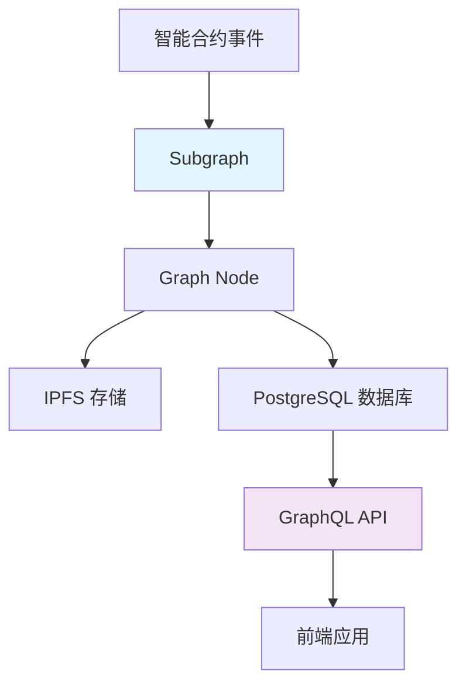
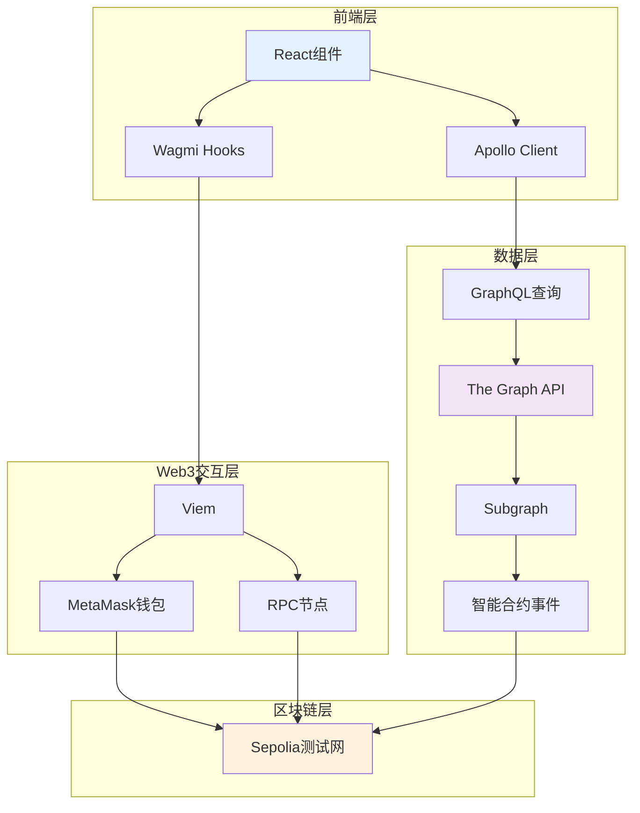

# 🌐 Web3 技术栈完全指南

> 🎯 **从零开始**：详细解释项目中使用的每个 Web3 技术，包含原理、作用和实际使用示例

## 📚 目录

1. [Ethers.js - 以太坊JavaScript库](#ethersjs---以太坊javascript库)
2. [The Graph - 去中心化数据索引](#the-graph---去中心化数据索引)
3. [Wagmi - React Web3 Hooks](#wagmi---react-web3-hooks)
4. [GraphQL - 查询语言](#graphql---查询语言)
5. [Viem - 现代以太坊库](#viem---现代以太坊库)
6. [技术栈协作关系](#技术栈协作关系)

---

## 🔗 Ethers.js - 以太坊JavaScript库

### 🤔 什么是 Ethers.js？

Ethers.js 是一个完整的以太坊开发库，让你可以用 JavaScript 与以太坊区块链交互。

**简单理解**：就像是一个"翻译器"，把复杂的区块链操作变成简单的 JavaScript 代码。

### 🎯 主要功能

#### 1. 🏦 连接区块链网络
```javascript
// 连接到以太坊网络
import { ethers } from 'ethers';

// 创建provider（连接到区块链的入口）
const provider = new ethers.JsonRpcProvider('https://ethereum-sepolia-rpc.publicnode.com');

// 获取当前区块号
const blockNumber = await provider.getBlockNumber();
console.log(`当前区块: ${blockNumber}`);
```

#### 2. 💰 查询账户余额
```javascript
// 查询某个地址的 ETH 余额
const address = "0x742d35cc6634C0532925a3b8d007f78e2dcbF2";
const balance = await provider.getBalance(address);

// 将 Wei 转换为 ETH（更易读的格式）
const ethBalance = ethers.formatEther(balance);
console.log(`余额: ${ethBalance} ETH`);
```

#### 3. 📋 查询交易信息
```javascript
// 根据交易哈希查询交易详情
const txHash = "0xabc123...";
const transaction = await provider.getTransaction(txHash);

console.log({
  from: transaction.from,        // 发送方
  to: transaction.to,           // 接收方
  value: ethers.formatEther(transaction.value), // 金额
  gasPrice: transaction.gasPrice.toString()     // Gas价格
});
```

#### 4. 💸 发送交易
```javascript
// 创建钱包（需要私钥）
const wallet = new ethers.Wallet("your-private-key", provider);

// 发送 ETH
const tx = await wallet.sendTransaction({
  to: "0x接收方地址",
  value: ethers.parseEther("0.1") // 发送 0.1 ETH
});

// 等待交易确认
const receipt = await tx.wait();
console.log(`交易成功: ${receipt.hash}`);
```

### 🏗️ 在项目中的应用

**文件位置**: `frontend/src/services/ethereumService.ts`

```typescript
export class EthereumService {
  private providers: ethers.JsonRpcProvider[] = [];

  // 初始化多个RPC提供者（提高可靠性）
  constructor() {
    const RPC_ENDPOINTS = [
      'https://ethereum-sepolia-rpc.publicnode.com',
      'https://rpc.sepolia.org',
      'https://ethereum-sepolia.publicnode.com'
    ];

    this.providers = RPC_ENDPOINTS.map(url => new ethers.JsonRpcProvider(url));
  }

  // 获取交易详情（带重试机制）
  async getTransaction(hash: string): Promise<Transaction | null> {
    return this.tryProviders(async (provider) => {
      const tx = await provider.getTransaction(hash);
      if (!tx) return null;

      // 格式化交易数据
      return {
        id: tx.hash,
        hash: tx.hash,
        from: { address: tx.from },
        to: tx.to ? { address: tx.to } : null,
        value: tx.value.toString(),
        gasUsed: tx.gasLimit?.toString() || '0',
        gasPrice: tx.gasPrice?.toString() || '0',
        blockNumber: tx.blockNumber?.toString() || '0',
        timestamp: '0', // 需要单独查询区块获取
        status: '1',
        transactionIndex: tx.index?.toString() || '0',
        data: tx.data || '0x'
      };
    });
  }
}
```

### 💡 学习要点

- **Provider**: 连接到区块链网络的入口点
- **Wallet**: 管理私钥和签名交易
- **Contract**: 与智能合约交互
- **Utils**: 格式转换工具（Wei ↔ ETH）

---

## 📊 The Graph - 去中心化数据索引

### 🤔 什么是 The Graph？

The Graph 是一个去中心化的数据索引协议，专门用于组织区块链数据。

**简单理解**：就像给区块链数据建立了一个"搜索引擎"，让你可以快速查询复杂的链上数据。

### 🎯 解决什么问题？

#### 问题：直接查询区块链很慢
```javascript
// 想要查询某个地址的所有交易记录？
// 传统方式：需要遍历每个区块，非常慢！
const transactions = [];
for (let i = startBlock; i <= endBlock; i++) {
  const block = await provider.getBlock(i);
  for (const txHash of block.transactions) {
    const tx = await provider.getTransaction(txHash);
    if (tx.from === targetAddress || tx.to === targetAddress) {
      transactions.push(tx);
    }
  }
}
// 这可能需要几分钟甚至几小时！
```

#### 解决方案：The Graph 预建索引
```javascript
// 使用 The Graph：几毫秒就能查到！
const { data } = await apolloClient.query({
  query: gql`
    query GetUserTransactions($userAddress: String!) {
      transferRecords(where: { 
        or: [
          { from: $userAddress },
          { to: $userAddress }
        ]
      }) {
        id
        from { address }
        to { address }
        value
        timestamp
      }
    }
  `,
  variables: { userAddress: "0x123..." }
});
```

### 🏗️ The Graph 架构



### 📝 Subgraph 配置

#### 1. Schema 定义 (schema.graphql)
```graphql
# 定义数据结构
type Account @entity(immutable: false) {
  id: ID!
  address: Bytes!
  transferRecordsSent: [TransferRecord!]! @derivedFrom(field: "from")
  transferRecordsReceived: [TransferRecord!]! @derivedFrom(field: "to")
  recordCount: BigInt!
}

type TransferRecord @entity(immutable: true) {
  id: ID!
  recordId: Bytes!
  from: Account!
  to: Account!
  value: BigInt!
  message: String!
  timestamp: BigInt!
  blockNumber: BigInt!
  transactionHash: Bytes!
}
```

#### 2. 数据映射 (mapping.ts)
```typescript
// 监听智能合约事件，自动建立索引
import { TransferRecord as TransferRecordEvent } from "../generated/SimpleTransferContract/SimpleTransferContract"
import { TransferRecord, Account } from "../generated/schema"

export function handleTransferRecord(event: TransferRecordEvent): void {
  // 创建新的转账记录
  let record = new TransferRecord(event.params.recordId.toHexString())
  
  // 设置字段值
  record.recordId = event.params.recordId
  record.from = getOrCreateAccount(event.params.from).id
  record.to = getOrCreateAccount(event.params.to).id
  record.value = event.params.value
  record.message = event.params.message
  record.timestamp = event.params.timestamp
  record.blockNumber = event.block.number
  record.transactionHash = event.transaction.hash

  // 保存到数据库
  record.save()
}

// 获取或创建账户实体
function getOrCreateAccount(address: Address): Account {
  let account = Account.load(address.toHexString())
  
  if (!account) {
    account = new Account(address.toHexString())
    account.address = address
    account.recordCount = BigInt.fromI32(0)
    account.save()
  }
  
  return account
}
```

#### 3. Subgraph 配置 (subgraph.yaml)
```yaml
specVersion: 0.0.5
schema:
  file: ./schema.graphql
dataSources:
  - kind: ethereum
    name: SimpleTransferContract
    network: sepolia
    source:
      address: "0x830B796F55E6A3f86E924297e510B24192A0Ba1c"
      abi: SimpleTransferContract
      startBlock: 9053891
    mapping:
      kind: ethereum/events
      apiVersion: 0.0.7
      language: wasm/assemblyscript
      entities:
        - TransferRecord
        - Account
      eventHandlers:
        - event: TransferRecord(indexed address,indexed address,uint256,uint256,string,bytes32)
          handler: handleTransferRecord
      file: ./src/mapping.ts
```

### 🚀 开发和部署流程

```bash
# 1. 生成代码
cd subgraph
pnpm codegen    # 根据schema和ABI生成TypeScript代码

# 2. 构建
pnpm build      # 编译mapping代码

# 3. 部署到The Graph Studio
pnpm deploy     # 部署到去中心化网络
```

### 💡 学习要点

- **Schema**: 定义数据结构，类似数据库表结构
- **Mapping**: 事件处理逻辑，将区块链事件转换为结构化数据
- **Entity**: 数据实体，存储在图数据库中
- **GraphQL**: 查询语言，用于获取结构化数据

---

## ⚛️ Wagmi - React Web3 Hooks

### 🤔 什么是 Wagmi？

Wagmi 是专为 React 设计的 Web3 Hooks 库，让你可以轻松地在 React 应用中集成区块链功能。

**简单理解**：就像 React 的 useState、useEffect，但是专门用来处理区块链操作。

### 🎯 核心概念

#### 1. 🔧 配置 (wagmi.ts)
```typescript
import { createConfig, http } from 'wagmi'
import { sepolia } from 'wagmi/chains'
import { injected, metaMask } from 'wagmi/connectors'

// 配置支持的区块链网络
export const wagmiConfig = createConfig({
  chains: [sepolia],  // 只支持Sepolia测试网
  connectors: [
    injected(),       // 通用注入式钱包
    metaMask(),      // MetaMask专用连接器
  ],
  transports: {
    [sepolia.id]: http() // HTTP传输层
  },
})
```

#### 2. 🏦 钱包连接
```typescript
import { useAccount, useConnect, useDisconnect } from 'wagmi'

function WalletConnection() {
  const { address, isConnected } = useAccount()
  const { connect, connectors } = useConnect()
  const { disconnect } = useDisconnect()

  if (isConnected) {
    return (
      <div>
        <p>已连接: {address}</p>
        <button onClick={() => disconnect()}>断开连接</button>
      </div>
    )
  }

  return (
    <div>
      {connectors.map((connector) => (
        <button 
          key={connector.id} 
          onClick={() => connect({ connector })}
        >
          连接 {connector.name}
        </button>
      ))}
    </div>
  )
}
```

#### 3. 💰 余额查询
```typescript
import { useBalance } from 'wagmi'

function BalanceDisplay() {
  const { address } = useAccount()
  
  const { data: balance, isLoading } = useBalance({
    address: address,
  })

  if (isLoading) return <div>查询余额中...</div>

  return (
    <div>
      余额: {balance?.formatted} {balance?.symbol}
    </div>
  )
}
```

#### 4. 💸 发送交易
```typescript
import { useSendTransaction, useWaitForTransactionReceipt } from 'wagmi'
import { parseEther } from 'viem'

function SendTransaction() {
  const { data: hash, sendTransaction } = useSendTransaction()
  
  // 等待交易确认
  const { isLoading: isConfirming, isSuccess } = useWaitForTransactionReceipt({ 
    hash 
  })

  const handleSend = () => {
    sendTransaction({
      to: '0x接收方地址',
      value: parseEther('0.1') // 发送0.1 ETH
    })
  }

  return (
    <div>
      <button onClick={handleSend}>发送交易</button>
      {isConfirming && <div>确认交易中...</div>}
      {isSuccess && <div>交易成功!</div>}
      {hash && <div>交易哈希: {hash}</div>}
    </div>
  )
}
```

### 🏗️ 在项目中的使用

**文件位置**: `frontend/src/components/WalletTransfer.tsx`

```typescript
const WalletTransfer: React.FC = ({ onTransactionSuccess }) => {
  // Wagmi hooks
  const { address, isConnected } = useAccount()
  const { connect, connectors } = useConnect()
  const { data: balance } = useBalance({ address })
  const { data: hash, sendTransaction } = useSendTransaction()
  const { isLoading: isConfirming, isSuccess } = useWaitForTransactionReceipt({ 
    hash 
  })

  // 本地状态
  const [toAddress, setToAddress] = useState<string>('')
  const [amount, setAmount] = useState<string>('')
  const [message, setMessage] = useState<string>('')

  // 处理转账
  const handleTransfer = async () => {
    if (!toAddress || !amount || !address) return;
    
    try {
      setIsTransferring(true);
      
      // 构建交易参数
      const txParams: {
        to: `0x${string}`;
        value: bigint;
        data?: `0x${string}`;
      } = {
        to: toAddress as `0x${string}`,
        value: parseEther(amount),
      };
      
      // 如果有附言，编码到data字段
      if (message.trim()) {
        txParams.data = str2hex(message.trim()) as `0x${string}`;
      }
      
      // 发送交易
      await sendTransaction(txParams);
    } catch (error) {
      console.error('Transfer error:', error);
      setIsTransferring(false);
    }
  };

  // 监听交易成功
  useEffect(() => {
    if (isSuccess && hash) {
      onTransactionSuccess?.(hash);
    }
  }, [isSuccess, hash, onTransactionSuccess]);

  return (
    <div>
      {/* 钱包连接UI */}
      {/* 转账表单UI */}
      {/* 交易状态UI */}
    </div>
  )
}
```

### 💡 学习要点

- **useAccount**: 获取当前连接的账户信息
- **useConnect**: 处理钱包连接
- **useBalance**: 查询账户余额
- **useSendTransaction**: 发送交易
- **useWaitForTransactionReceipt**: 等待交易确认

---

## 🔍 GraphQL - 查询语言

### 🤔 什么是 GraphQL？

GraphQL 是一种用于 API 的查询语言和运行时环境，让你可以精确地请求你需要的数据。

**简单理解**：就像在餐厅点菜，你可以精确地说要什么，而不是只能选择套餐。

### 🆚 GraphQL vs REST API

#### REST API（传统方式）
```javascript
// 需要多个请求获取完整信息
const user = await fetch('/api/users/123')
const posts = await fetch('/api/users/123/posts') 
const comments = await fetch('/api/posts/456/comments')

// 问题：
// 1. 多个请求，延迟高
// 2. 返回数据可能包含不需要的字段
// 3. 需要多个端点
```

#### GraphQL（新方式）
```javascript
// 一个请求获取所有需要的数据
const { data } = await apolloClient.query({
  query: gql`
    query GetUserInfo($userId: ID!) {
      user(id: $userId) {
        name
        email
        posts(first: 10) {
          title
          content
          comments(first: 5) {
            text
            author
          }
        }
      }
    }
  `,
  variables: { userId: "123" }
})

// 优势：
// 1. 一个请求搞定
// 2. 只返回需要的字段
// 3. 类型安全
```

### 🏗️ GraphQL 查询结构

#### 1. 基本查询
```graphql
# 查询语法
query {
  transferRecords {    # 查询转账记录
    id                 # 返回ID字段
    value             # 返回金额字段
    timestamp         # 返回时间戳字段
  }
}
```

#### 2. 带参数查询
```graphql
# 根据条件筛选
query GetTransactionsByAddress($userAddress: Bytes!) {
  transferRecords(
    where: { from: $userAddress }  # WHERE条件
    first: 10                      # 限制返回10条
    orderBy: timestamp             # 按时间排序
    orderDirection: desc           # 降序
  ) {
    id
    from { address }
    to { address }
    value
    message
    timestamp
  }
}
```

#### 3. 嵌套查询
```graphql
# 查询账户及其相关的转账记录
query GetAccountDetails($accountId: ID!) {
  account(id: $accountId) {
    address
    recordCount
    transferRecordsSent {      # 发送的记录
      id
      to { address }
      value
      timestamp
    }
    transferRecordsReceived {  # 接收的记录
      id
      from { address }
      value
      timestamp
    }
  }
}
```

### 🔧 在项目中的使用

**文件位置**: `frontend/src/hooks/useTransactionQuery.ts`

```typescript
import { useQuery } from '@apollo/client/react';
import { gql } from '@apollo/client';

// GraphQL查询定义
export const GET_TRANSACTIONS = gql`
  query GetTransactions($first: Int = 10, $skip: Int = 0) {
    transferRecords(
      first: $first, 
      skip: $skip, 
      orderBy: blockNumber, 
      orderDirection: desc
    ) {
      id
      recordId
      from {
        address
      }
      to {
        address
      }
      value
      message
      timestamp
      blockNumber
      transactionHash
    }
  }
`;

// React Hook封装
export const useTransactionsQuery = (first: number = 10, skip: number = 0, enabled: boolean = true) => {
  return useQuery<TransactionsData>(GET_TRANSACTIONS, {
    variables: { first, skip },
    skip: !enabled,  // 条件查询控制
    pollInterval: 30000, // 每30秒自动刷新
  });
};
```

**文件位置**: `frontend/src/components/TransactionList.tsx`

```typescript
const TransactionList: React.FC = () => {
  // 使用GraphQL Hook
  const { data, loading, error } = useTransactionsQuery(20, 0, true);
  const { data: metaData } = useMetaQuery(true);

  if (loading) return <p>加载最新交易中...</p>;
  
  if (error) return (
    <div style={{ color: 'red' }}>
      GraphQL查询错误: {error.message}
    </div>
  );

  return (
    <div>
      {/* 显示The Graph同步状态 */}
      {metaData && (
        <div>
          当前同步区块: #{metaData._meta.block.number}
        </div>
      )}
      
      {/* 显示转账记录 */}
      {data?.transferRecords?.map((tx) => (
        <div key={tx.id}>
          <p>从 {tx.from.address} 到 {tx.to.address}</p>
          <p>金额: {formatEther(tx.value)} ETH</p>
          <p>附言: {tx.message}</p>
          <p>时间: {formatTimestamp(tx.timestamp)}</p>
        </div>
      ))}
    </div>
  );
};
```

### 💡 学习要点

- **Query**: 读取数据操作
- **Variables**: 查询参数，提高复用性
- **Fragment**: 查询片段，避免重复
- **Subscription**: 实时数据订阅（高级用法）

---

## ⚡ Viem - 现代以太坊库

### 🤔 什么是 Viem？

Viem 是一个现代化的 TypeScript 以太坊库，提供类型安全的区块链交互接口。

**简单理解**：Viem 是 Ethers.js 的现代化替代品，更快、更安全、更好的 TypeScript 支持。

### 🆚 Viem vs Ethers.js

#### 传统 Ethers.js
```javascript
import { ethers } from 'ethers';

// 需要手动处理类型转换
const provider = new ethers.JsonRpcProvider('...');
const balance = await provider.getBalance(address);
const ethBalance = ethers.formatEther(balance); // 手动格式化
```

#### 现代 Viem
```typescript
import { createPublicClient, http, formatEther } from 'viem';
import { sepolia } from 'viem/chains';

// 自动类型推断，更好的TypeScript支持
const client = createPublicClient({
  chain: sepolia,
  transport: http()
});

const balance = await client.getBalance({ address }); // 完整类型安全
const ethBalance = formatEther(balance); // 自动类型推断
```

### 🔧 核心功能

#### 1. 🏦 创建客户端
```typescript
import { createPublicClient, createWalletClient, http } from 'viem'
import { sepolia } from 'viem/chains'

// 公共客户端（只读操作）
const publicClient = createPublicClient({
  chain: sepolia,
  transport: http('https://ethereum-sepolia-rpc.publicnode.com')
})

// 钱包客户端（可发送交易）
const walletClient = createWalletClient({
  chain: sepolia,
  transport: http()
})
```

#### 2. 📊 读取区块链数据
```typescript
// 查询余额
const balance = await publicClient.getBalance({ 
  address: '0x...' 
})

// 查询区块信息
const block = await publicClient.getBlock({ 
  blockNumber: 123456n 
})

// 查询交易
const transaction = await publicClient.getTransaction({ 
  hash: '0x...' 
})

// 查询交易收据
const receipt = await publicClient.getTransactionReceipt({ 
  hash: '0x...' 
})
```

#### 3. 💸 发送交易
```typescript
import { parseEther } from 'viem'

// 发送ETH
const hash = await walletClient.sendTransaction({
  to: '0x...',
  value: parseEther('0.1'), // 0.1 ETH
  data: '0x1234' // 可选的交易数据
})

// 等待交易确认
const receipt = await publicClient.waitForTransactionReceipt({ 
  hash 
})
```

#### 4. 📜 智能合约交互
```typescript
// 读取合约状态
const result = await publicClient.readContract({
  address: '0x合约地址',
  abi: contractAbi,
  functionName: 'balanceOf',
  args: ['0x用户地址']
})

// 调用合约方法
const hash = await walletClient.writeContract({
  address: '0x合约地址',
  abi: contractAbi,
  functionName: 'transfer',
  args: ['0x接收方', parseUnits('100', 18)]
})
```

### 🏗️ 在项目中的集成

#### 与 Wagmi 的关系
```typescript
// Wagmi 内部使用 Viem
import { useAccount, useSendTransaction } from 'wagmi'
import { parseEther } from 'viem' // 直接使用Viem工具函数

function TransferComponent() {
  const { sendTransaction } = useSendTransaction()
  
  const handleSend = () => {
    sendTransaction({
      to: '0x...',
      value: parseEther('0.1') // Viem的类型安全函数
    })
  }
  
  return <button onClick={handleSend}>发送</button>
}
```

#### 类型安全的好处
```typescript
// Viem提供完整的TypeScript类型
import { Address, Hash, parseEther, formatEther } from 'viem'

interface TransferParams {
  to: Address;        // 自动验证地址格式
  amount: string;     // ETH金额字符串
  data?: Hash;        // 可选的交易数据
}

function createTransfer(params: TransferParams) {
  return {
    to: params.to,
    value: parseEther(params.amount), // 自动转换为bigint
    data: params.data
  }
}
```

### 💡 学习要点

- **Type Safety**: 完整的TypeScript类型支持
- **Performance**: 比Ethers.js更快的执行速度  
- **Modern API**: 更简洁的API设计
- **Tree Shaking**: 只打包使用的功能，减小包体积

---

## 🔄 技术栈协作关系

### 🎯 数据流架构图



### 🔗 技术协作关系

#### 1. 🎨 前端UI层
- **React**: 组件化UI框架
- **TypeScript**: 类型安全开发
- **Vite**: 快速开发构建工具

#### 2. 🌐 Web3集成层
- **Wagmi**: 提供React Hooks，简化Web3操作
- **Viem**: 底层区块链交互，类型安全
- **MetaMask**: 用户钱包连接

#### 3. 📊 数据查询层
- **Apollo Client**: GraphQL客户端，状态管理
- **GraphQL**: 查询语言，精确获取数据
- **The Graph**: 去中心化数据索引

#### 4. ⛓️ 区块链层
- **Smart Contract**: 业务逻辑执行
- **Sepolia**: 以太坊测试网络
- **RPC**: 区块链节点通信协议

### 🔄 典型的用户操作流程

#### 💰 发送转账操作
```typescript
// 1. 用户在React组件中操作
function TransferForm() {
  // 2. 使用Wagmi Hook管理状态
  const { sendTransaction } = useSendTransaction()
  const { address } = useAccount()
  
  const handleTransfer = async () => {
    // 3. 调用Viem进行类型安全的交易构建
    await sendTransaction({
      to: toAddress as Address,
      value: parseEther(amount),
      data: str2hex(message) as Hash
    })
  }
  
  // 4. MetaMask处理签名和广播
  // 5. 交易上链到Sepolia网络
  // 6. 智能合约执行并触发事件
  // 7. The Graph监听事件并更新索引
}
```

#### 🔍 查询交易数据
```typescript
function TransactionQuery() {
  // 1. 使用Apollo Client + GraphQL查询
  const { data } = useQuery(gql`
    query GetTransactions {
      transferRecords {
        id
        from { address }
        to { address }
        value
        message
      }
    }
  `)
  
  // 2. The Graph返回结构化数据
  // 3. React组件渲染结果
  return (
    <div>
      {data?.transferRecords?.map(tx => (
        <div key={tx.id}>
          {/* 4. 显示完整地址和格式化数据 */}
          <p>{tx.from.address} → {tx.to.address}</p>
          <p>{formatEther(tx.value)} ETH</p>
        </div>
      ))}
    </div>
  )
}
```

### 📚 学习建议

1. **🚀 入门顺序**：
   - React基础 → TypeScript → Viem基础 → Wagmi → GraphQL → The Graph

2. **🛠️ 实践方法**：
   - 先理解每个技术的单独作用
   - 然后理解它们如何协作
   - 最后通过项目实践掌握

3. **📖 重点资源**：
   - [Wagmi官方文档](https://wagmi.sh/)
   - [Viem官方文档](https://viem.sh/) 
   - [The Graph文档](https://thegraph.com/docs/)
   - [GraphQL学习指南](https://graphql.org/learn/)

---

## 🎯 总结

每个技术都有其特定的作用：

- **🔗 Ethers.js/Viem**: 与区块链直接通信的桥梁
- **📊 The Graph**: 让复杂数据查询变得简单快速  
- **⚛️ Wagmi**: 让React开发者轻松使用Web3功能
- **🔍 GraphQL**: 精确查询需要的数据，避免过度获取
- **⚡ Viem**: 现代化、类型安全的区块链交互

掌握这些技术，你就能构建完整的Web3应用！🚀