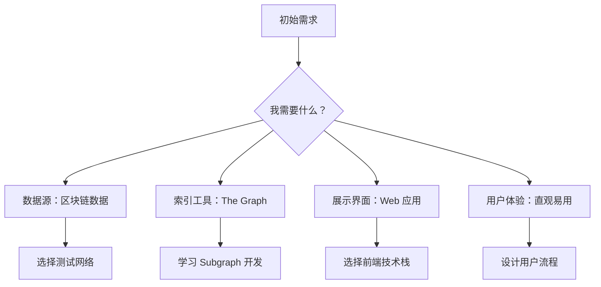
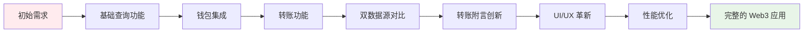
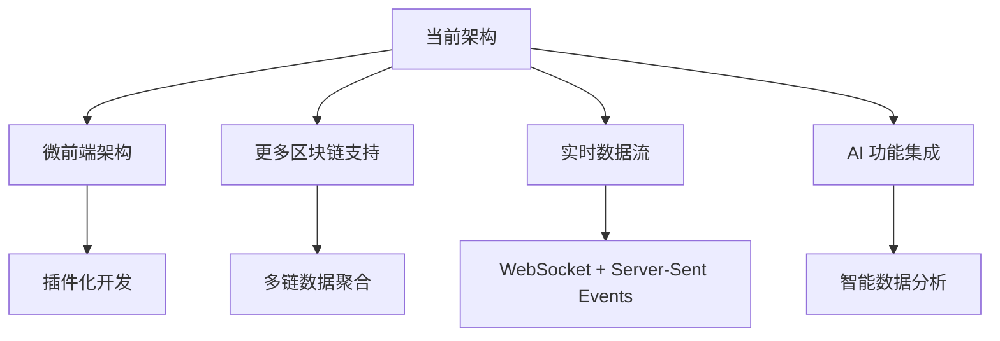

# 🚀 从零到一：Sepolia Subgraph 项目开发全程实录

> 📖 **沉浸式开发故事**：跟随一个简单需求如何演化成完整的 Web3 数据查询系统

## 🎯 第一章：需求的诞生

### 初始需求
**"使用 The Graph 数据上链的代码读回 Sepolia 上的交易信息进行展示"**

这是一个看似简单的需求，但它包含了现代 Web3 开发的核心挑战：
- 🔗 如何与区块链数据交互
- 📊 如何高效索引和查询数据
- 🎨 如何友好地展示复杂数据

### 需求分析：我们需要什么？

当我坐下来分析这个需求时，我意识到需要解决几个关键问题：



**第一个决策**：选择 Sepolia 测试网
- ✅ 免费使用，适合学习
- ✅ 官方支持，稳定可靠
- ✅ 工具丰富，开发友好

---

## 🏗️ 第二章：技术选型的思考过程

### 前端框架选择：为什么是 React + TypeScript？

```typescript
// 我的技术选型思考过程
interface TechChoice {
  framework: 'React' | 'Vue' | 'Angular';
  language: 'JavaScript' | 'TypeScript';
  reasoning: string[];
}

const myChoice: TechChoice = {
  framework: 'React',
  language: 'TypeScript',
  reasoning: [
    '🔥 React: 生态最成熟，Web3 集成库丰富',
    '🛡️ TypeScript: 类型安全，避免区块链数据处理错误',
    '📚 学习资源丰富，社区活跃',
    '🔧 工具链完善：Vite + ESLint + Wagmi'
  ]
};
```

**关键考虑因素**：
- **Web3 生态支持**：Wagmi、RainbowKit 等库对 React 支持最好
- **类型安全**：区块链数据复杂，TypeScript 能避免很多运行时错误
- **开发体验**：热重载、代码提示、错误检测

### 构建工具：Vite vs Create React App

```bash
# 我的选择过程
echo "Create React App 太重了，启动慢"
echo "Vite 轻量快速，现代化"
echo "决定：使用 Vite + React + TypeScript"

pnpm create vite frontend --template react-ts
```

---

## 🎨 第三章：第一个界面的诞生

### 最小可用产品（MVP）设计

我的第一个目标很简单：**创建一个能显示交易信息的界面**

```tsx
// 最初的 App.tsx - 极简版本
function App() {
  return (
    <div style={{ padding: '20px' }}>
      <h1>Sepolia 交易查询工具</h1>
      <input type="text" placeholder="输入交易哈希" />
      <button>查询</button>
      <div>
        {/* 这里将显示交易信息 */}
      </div>
    </div>
  );
}
```

### 第一次运行的激动

```bash
cd frontend
pnpm install
pnpm dev
```

当我在浏览器中看到 `http://localhost:5176` 显示出第一个界面时，虽然功能还很简陋，但那种"我正在构建一个 Web3 应用"的感觉让人兴奋！

---

## 🔗 第四章：连接区块链的第一步

### 安装 Web3 依赖

```bash
# 我记得当时查阅了很多资料，最终选择了这些库
pnpm add wagmi viem @tanstack/react-query

# 为什么选择这些？
# wagmi: 现代化的 React Web3 Hooks，比 web3-react 更好用
# viem: 轻量级以太坊库，比 ethers.js 性能更好
# react-query: wagmi 依赖，提供强大的数据缓存
```

### 配置 Wagmi

```tsx
// config/wagmi.ts - 我的第一个 Web3 配置
import { createConfig, http } from 'wagmi';
import { sepolia } from 'wagmi/chains';
import { injected, metaMask } from 'wagmi/connectors';

// 这个配置文件我改了很多次，最终稳定在这个版本
export const wagmiConfig = createConfig({
  chains: [sepolia],
  connectors: [
    injected(), // 支持各种注入式钱包
    metaMask(), // 专门支持 MetaMask
  ],
  transports: {
    // 找一个稳定的免费 RPC 节点花了不少时间
    [sepolia.id]: http('https://ethereum-sepolia-rpc.publicnode.com'),
  },
});
```

### 第一次钱包连接

```tsx
// 我永远记得第一次成功连接 MetaMask 的兴奋
function WalletConnection() {
  const { address, isConnected } = useAccount();
  const { connect, connectors } = useConnect();

  return (
    <div>
      {!isConnected ? (
        <button onClick={() => connect({ connector: connectors[0] })}>
          连接 MetaMask
        </button>
      ) : (
        <p>已连接: {address}</p>
      )}
    </div>
  );
}
```

**第一次成功的瞬间**：当我点击"连接 MetaMask"，MetaMask 弹窗出现，我确认连接，然后界面显示了我的钱包地址时，我知道我已经成功迈出了 Web3 开发的第一步！

---

## 📊 第五章：The Graph 集成的探索之路

### 理解 The Graph 的必要性

起初我尝试直接用 RPC 查询所有数据：

```tsx
// 最初的天真尝试 - 性能很差
const getAllTransactions = async () => {
  const transactions = [];
  
  // 这样查询太慢了！每个区块都要单独请求
  for (let i = startBlock; i <= currentBlock; i++) {
    const block = await provider.getBlock(i);
    transactions.push(...block.transactions);
  }
  
  return transactions; // 这个过程可能需要几分钟！
};
```

**现实打击**：这种方法完全不现实！查询 10000 个区块需要几分钟，用户体验太差。

**这时我才真正理解了 The Graph 的价值**：
- 🚀 预索引数据，查询速度极快
- 🔍 强大的 GraphQL 查询能力
- 📈 可扩展的数据处理架构

### 创建第一个 Subgraph

```bash
# 初始化 subgraph 项目
mkdir subgraph
cd subgraph
pnpm init
pnpm add @graphprotocol/graph-cli @graphprotocol/graph-ts
```

### 定义数据模型

```graphql
# schema.graphql - 我的第一个数据模型
type TransferRecord @entity {
  id: String!
  from: String!
  to: String!
  amount: BigInt!
  timestamp: BigInt!
  blockNumber: BigInt!
  transactionHash: String!
}

type Account @entity {
  id: String!
  totalSent: BigInt!
  totalReceived: BigInt!
  transactionCount: Int!
}
```

### 智能合约部署

为了有数据可以索引，我需要部署一个简单的合约：

```solidity
// SimpleTransferContract.sol
contract SimpleTransferContract {
    event TransferRecord(
        address indexed from,
        address indexed to,
        uint256 amount,
        string message
    );

    function recordTransfer(
        address to,
        uint256 amount,
        string memory message
    ) external payable {
        emit TransferRecord(msg.sender, to, amount, message);
    }
}
```

**部署的紧张时刻**：
```bash
# 使用 Remix IDE 部署到 Sepolia
# 合约地址: 0x830B796F55E6A3f86E924297e510B24192A0Ba1c
# 起始区块: 9053891
```

---

## 🎯 第六章：数据映射逻辑的实现

### 编写事件处理器

```typescript
// src/mapping.ts - 核心数据处理逻辑
export function handleTransferRecord(event: TransferRecordEvent): void {
  // 创建交易记录
  let transferRecord = new TransferRecord(
    event.transaction.hash.toHex() + "-" + event.logIndex.toString()
  );
  
  transferRecord.from = event.params.from.toHex();
  transferRecord.to = event.params.to.toHex();
  transferRecord.amount = event.params.amount;
  transferRecord.message = event.params.message;
  transferRecord.timestamp = event.block.timestamp;
  transferRecord.blockNumber = event.block.number;
  transferRecord.transactionHash = event.transaction.hash.toHex();
  
  transferRecord.save();
  
  // 更新账户统计
  updateAccountStats(event.params.from, event.params.to, event.params.amount);
}
```

### 第一次部署 Subgraph

```bash
# 构建和部署过程
pnpm codegen  # 生成 TypeScript 类型
pnpm build    # 构建 subgraph
pnpm deploy   # 部署到 The Graph Studio

# 部署成功后的激动！
echo "🎉 Subgraph 部署成功！"
echo "GraphQL 端点: https://api.studio.thegraph.com/query/119398/sepolia-transactions/v1.1.0"
```

---

## 🔍 第七章：前端查询功能的完善

### Apollo Client 集成

```tsx
// apolloClient/client.ts
import { ApolloClient, InMemoryCache, createHttpLink } from '@apollo/client';

const httpLink = createHttpLink({
  uri: 'https://api.studio.thegraph.com/query/119398/sepolia-transactions/v1.1.0',
});

export const apolloClient = new ApolloClient({
  link: httpLink,
  cache: new InMemoryCache(),
});
```

### 第一个 GraphQL 查询

```tsx
// hooks/useTransactionQuery.ts
const GET_TRANSACTION = gql`
  query GetTransaction($hash: String!) {
    transferRecords(where: {transactionHash: $hash}) {
      id
      from
      to
      amount
      message
      timestamp
      blockNumber
      transactionHash
    }
  }
`;

export const useTransactionQuery = (hash: string) => {
  return useQuery(GET_TRANSACTION, {
    variables: { hash },
    skip: !hash, // 优化：没有 hash 时跳过查询
  });
};
```

### 第一次成功查询的激动

```tsx
// TransactionQuery.tsx - 第一个工作版本
function TransactionQuery() {
  const [txHash, setTxHash] = useState('');
  const { data, loading, error } = useTransactionQuery(txHash);

  const handleQuery = () => {
    if (txHash.trim()) {
      // 触发查询
      console.log('查询交易:', txHash);
    }
  };

  return (
    <div>
      <input
        value={txHash}
        onChange={(e) => setTxHash(e.target.value)}
        placeholder="输入交易哈希"
      />
      <button onClick={handleQuery}>查询</button>
      
      {loading && <p>查询中...</p>}
      {error && <p>错误: {error.message}</p>}
      {data?.transferRecords?.map(tx => (
        <div key={tx.id}>
          <p>从: {tx.from}</p>
          <p>到: {tx.to}</p>
          <p>金额: {tx.amount}</p>
          <p>时间: {new Date(tx.timestamp * 1000).toLocaleString()}</p>
        </div>
      ))}
    </div>
  );
}
```

**第一次查询成功**：当我输入一个真实的交易哈希，点击查询，数据立即显示出来时，那种成就感难以言喻！我的 Web3 应用真的能工作了！

---

## ⚡ 第八章：性能对比功能的加入

### 双数据源设计

我意识到一个重要的教育价值：**展示 RPC 查询与 The Graph 索引的区别**

```tsx
// ethereumService.ts - RPC 查询服务
class EthereumService {
  private providers: JsonRpcProvider[];
  
  constructor() {
    // 多 RPC 节点配置，提高可靠性
    this.providers = [
      new JsonRpcProvider('https://ethereum-sepolia-rpc.publicnode.com'),
      new JsonRpcProvider('https://sepolia.infura.io/v3/your-key'),
      new JsonRpcProvider('https://rpc.sepolia.org')
    ];
  }

  // 故障转移查询
  private async queryWithFailover<T>(
    operation: (provider: JsonRpcProvider) => Promise<T>
  ): Promise<T> {
    for (const provider of this.providers) {
      try {
        return await operation(provider);
      } catch (error) {
        console.warn(`RPC 节点失败，尝试下一个...`);
        continue;
      }
    }
    throw new Error('所有 RPC 节点都失败了');
  }
}
```

### 性能对比界面

```tsx
// 添加数据源选择
function TransactionQuery() {
  const [dataSource, setDataSource] = useState<'rpc' | 'graph'>('graph');
  const [queryTime, setQueryTime] = useState<number>(0);

  const handleQuery = async () => {
    const startTime = Date.now();
    
    if (dataSource === 'rpc') {
      await queryFromRPC(txHash);
    } else {
      await queryFromGraph(txHash);
    }
    
    setQueryTime(Date.now() - startTime);
  };

  return (
    <div>
      <div>
        <button 
          onClick={() => setDataSource('rpc')}
          style={{ background: dataSource === 'rpc' ? '#007bff' : '#6c757d' }}
        >
          RPC 查询 (实时)
        </button>
        <button 
          onClick={() => setDataSource('graph')}
          style={{ background: dataSource === 'graph' ? '#007bff' : '#6c757d' }}
        >
          The Graph 查询 (索引)
        </button>
      </div>
      
      {queryTime > 0 && (
        <p>查询耗时: {queryTime}ms</p>
      )}
    </div>
  );
}
```

---

## 💰 第九章：钱包集成的完善

### 转账功能实现

```tsx
// WalletTransfer.tsx - 完整的转账功能
function WalletTransfer() {
  const [toAddress, setToAddress] = useState('');
  const [amount, setAmount] = useState('');
  
  const { data: hash, sendTransaction, isPending } = useSendTransaction();

  const handleTransfer = () => {
    sendTransaction({
      to: toAddress as `0x${string}`,
      value: parseEther(amount),
    });
  };

  return (
    <div>
      <input
        value={toAddress}
        onChange={(e) => setToAddress(e.target.value)}
        placeholder="接收地址"
      />
      <input
        value={amount}
        onChange={(e) => setAmount(e.target.value)}
        placeholder="转账金额 (ETH)"
      />
      <button 
        onClick={handleTransfer}
        disabled={isPending}
      >
        {isPending ? '发送中...' : '发送交易'}
      </button>
    </div>
  );
}
```

### 第一次真实转账

**那个激动人心的时刻**：
1. 我在 Sepolia 水龙头获取了测试 ETH
2. 在我的应用中输入接收地址和金额
3. 点击"发送交易"
4. MetaMask 弹窗，我确认交易
5. 交易哈希返回：`0x...`
6. 几秒钟后，我在区块链浏览器中看到了我的交易！

**更激动的是**：几分钟后，我的 Subgraph 索引了这笔交易，我可以在自己的应用中查询到它！

---

## 💬 第十章：转账附言功能的创新

### 需求的产生

在使用过程中，我发现一个问题：**转账没有备注信息，不够直观**。

我想到一个创新的解决方案：**利用交易的 data 字段存储消息**！

### 十六进制编码工具

```typescript
// utils/hexUtils.ts - 核心编码工具
export function str2hex(str: string): string {
  if (!str) return '0x';
  
  const arr = ['0x'];
  
  for (let i = 0; i < str.length; i++) {
    const codePoint = str.codePointAt(i);
    
    if (codePoint === undefined) continue;
    
    // 处理代理对（Emoji 支持）
    if (codePoint > 0xffff) {
      i++; // 跳过代理对的低位
    }
    
    arr.push(codePoint.toString(16).padStart(4, '0'));
  }
  
  return arr.join('');
}

export function hex2str(hex: string): string {
  let rawStr = hex.startsWith('0x') ? hex.slice(2) : hex;
  
  if (rawStr.length % 4 !== 0) {
    throw new Error('Invalid hex string length');
  }
  
  const result = [];
  for (let i = 0; i < rawStr.length; i += 4) {
    const hexCode = rawStr.slice(i, i + 4);
    const codePoint = parseInt(hexCode, 16);
    result.push(String.fromCodePoint(codePoint));
  }
  
  return result.join('');
}
```

### 转账附言界面

```tsx
// WalletTransfer.tsx - 添加消息功能
function WalletTransfer() {
  const [message, setMessage] = useState('');

  const handleTransfer = () => {
    const txParams: any = {
      to: toAddress as `0x${string}`,
      value: parseEther(amount),
    };

    // 如果有消息，编码为 data 字段
    if (message.trim()) {
      txParams.data = str2hex(message.trim()) as `0x${string}`;
    }

    sendTransaction(txParams);
  };

  return (
    <div>
      {/* 其他字段... */}
      
      <textarea
        value={message}
        onChange={(e) => setMessage(e.target.value)}
        placeholder="转账附言 (可选，支持中文和 Emoji)"
        maxLength={200}
      />
      
      <div>
        <span>{message.length}/200 字符</span>
        {message.trim() && (
          <span>
            编码后约 {getHexByteLength(message)} 字节 
            (Gas 费用: +{Math.ceil(getHexByteLength(message) * 16 / 1000)}k)
          </span>
        )}
      </div>
    </div>
  );
}
```

### 第一次带消息的转账

**历史性的一刻**：
```
消息: "你好世界! 🌍 这是我的第一笔带附言的区块链转账"
编码: 0x4f60597d754c... (一串十六进制)
交易哈希: 0x7a8b9c...
```

当我在交易查询页面看到这条消息被完美解码显示时，我知道我创造了一个很酷的功能！

---

## 🎨 第十一章：UI/UX 的重大升级

### 从表格到卡片的转变

初期的界面很丑：

```tsx
// 早期版本 - 简陋的表格
<table>
  <tr>
    <td>{tx.from.substring(0, 10)}...</td>
    <td>{tx.to.substring(0, 10)}...</td>
    <td>{parseFloat(formatEther(tx.amount)).toFixed(4)}</td>
  </tr>
</table>
```

**问题**：
- 地址被截断，看不全
- 信息密集，难以阅读
- 移动端体验差

### 卡片式设计的实现

```tsx
// 新版本 - 优雅的卡片设计
const TransactionCard = ({ tx }: { tx: TransferRecord }) => (
  <div style={{
    background: 'linear-gradient(135deg, #667eea 0%, #764ba2 100%)',
    borderRadius: '16px',
    padding: '24px',
    marginBottom: '16px',
    boxShadow: '0 8px 32px rgba(0,0,0,0.1)',
    color: 'white'
  }}>
    <div style={{
      display: 'grid',
      gridTemplateColumns: 'repeat(auto-fit, minmax(300px, 1fr))',
      gap: '16px'
    }}>
      {/* 完整地址显示 */}
      <div>
        <strong style={{ color: '#ffcdd2' }}>📤 发送方:</strong>
        <div style={{
          fontFamily: 'monospace',
          wordBreak: 'break-all',
          background: 'rgba(255,255,255,0.1)',
          padding: '8px',
          borderRadius: '8px',
          marginTop: '4px'
        }}>
          {tx.from}
        </div>
      </div>
      
      <div>
        <strong style={{ color: '#c8e6c9' }}>📥 接收方:</strong>
        <div style={{
          fontFamily: 'monospace',
          wordBreak: 'break-all',
          background: 'rgba(255,255,255,0.1)',
          padding: '8px',
          borderRadius: '8px',
          marginTop: '4px'
        }}>
          {tx.to}
        </div>
      </div>
    </div>
    
    {/* 消息显示 */}
    {tx.message && (
      <div style={{ marginTop: '16px' }}>
        <strong style={{ color: '#4a148c' }}>💬 转账附言:</strong>
        <div style={{
          background: 'rgba(255,255,255,0.1)',
          padding: '12px',
          borderRadius: '8px',
          marginTop: '8px'
        }}>
          {tx.message}
        </div>
      </div>
    )}
  </div>
);
```

### 响应式布局

```css
/* index.css - 响应式设计 */
.transaction-grid {
  display: grid;
  grid-template-columns: repeat(auto-fit, minmax(300px, 1fr));
  gap: 16px;
  padding: 20px;
}

@media (max-width: 768px) {
  .transaction-grid {
    grid-template-columns: 1fr;
    padding: 10px;
  }
  
  .address-display {
    font-size: 12px;
  }
}
```

---

## 🔄 第十二章：多数据源架构的完善

### 以太坊服务层重构

```typescript
// services/ethereumService.ts - 最终版本
class EthereumService {
  private providers: JsonRpcProvider[];
  private successfulProviders: Set<JsonRpcProvider> = new Set();

  async getTransaction(hash: string): Promise<TransactionData | null> {
    return this.queryWithFailover(async (provider) => {
      const tx = await provider.getTransaction(hash);
      if (!tx) return null;

      const receipt = await provider.getTransactionReceipt(hash);
      const block = await provider.getBlock(tx.blockNumber!);

      return {
        hash: tx.hash,
        from: tx.from,
        to: tx.to || '',
        value: tx.value.toString(),
        gasPrice: tx.gasPrice?.toString() || '0',
        gasUsed: receipt?.gasUsed?.toString() || '0',
        blockNumber: tx.blockNumber || 0,
        timestamp: block?.timestamp || 0,
        status: receipt?.status === 1 ? 'success' : 'failed',
        message: this.parseMessage(tx.data), // 解析附言
      };
    });
  }

  private parseMessage(data: string): string | null {
    try {
      return data && data !== '0x' ? hex2str(data) : null;
    } catch {
      return null;
    }
  }
}
```

### 统一数据接口

```typescript
// types/transaction.ts - 统一的数据结构
export interface TransactionData {
  hash: string;
  from: string;
  to: string;
  value: string;
  timestamp: number;
  blockNumber: number;
  message?: string;
  source: 'rpc' | 'graph';
  queryTime?: number;
}
```

---

## 📊 第十三章：数据可视化的加入

### 统计概览组件

```tsx
// components/DataOverview.tsx
function DataOverview() {
  const { data: stats } = useQuery(GET_STATS);
  
  return (
    <div style={{
      display: 'grid',
      gridTemplateColumns: 'repeat(auto-fit, minmax(250px, 1fr))',
      gap: '20px',
      padding: '20px'
    }}>
      <StatCard
        icon="📊"
        title="总交易数"
        value={stats?.totalTransactions || 0}
        color="#4caf50"
      />
      
      <StatCard
        icon="👥"
        title="活跃账户"
        value={stats?.activeAccounts || 0}
        color="#2196f3"
      />
      
      <StatCard
        icon="💰"
        title="总转账量"
        value={`${parseFloat(formatEther(stats?.totalVolume || 0)).toFixed(2)} ETH`}
        color="#ff9800"
      />
      
      <StatCard
        icon="⏱️"
        title="最新区块"
        value={stats?.latestBlock || 0}
        color="#9c27b0"
      />
    </div>
  );
}

const StatCard = ({ icon, title, value, color }: StatCardProps) => (
  <div style={{
    background: 'white',
    borderRadius: '12px',
    padding: '24px',
    boxShadow: '0 4px 20px rgba(0,0,0,0.1)',
    border: `3px solid ${color}`,
    textAlign: 'center'
  }}>
    <div style={{ fontSize: '48px', marginBottom: '12px' }}>{icon}</div>
    <h3 style={{ color: '#666', fontSize: '16px', marginBottom: '8px' }}>
      {title}
    </h3>
    <p style={{ color: color, fontSize: '28px', fontWeight: 'bold', margin: 0 }}>
      {value}
    </p>
  </div>
);
```

---

## 🚀 第十四章：部署与优化

### 构建优化

```typescript
// vite.config.ts - 生产构建优化
export default defineConfig({
  build: {
    outDir: 'dist',
    sourcemap: true,
    minify: 'terser',
    rollupOptions: {
      output: {
        manualChunks: {
          vendor: ['react', 'react-dom'],
          web3: ['wagmi', 'viem', '@tanstack/react-query'],
          graphql: ['@apollo/client', 'graphql'],
        },
      },
    },
  },
  optimizeDeps: {
    include: ['wagmi', 'viem', '@apollo/client'],
  },
});
```

### 性能监控

```tsx
// hooks/usePerformanceMonitor.ts
export const usePerformanceMonitor = () => {
  const [metrics, setMetrics] = useState({
    rpcQueryTime: 0,
    graphQueryTime: 0,
    renderTime: 0,
  });

  const measureQuery = async (
    queryFn: () => Promise<any>,
    type: 'rpc' | 'graph'
  ) => {
    const startTime = performance.now();
    const result = await queryFn();
    const endTime = performance.now();
    
    setMetrics(prev => ({
      ...prev,
      [`${type}QueryTime`]: endTime - startTime,
    }));
    
    return result;
  };

  return { metrics, measureQuery };
};
```

---

## 📖 第十五章：文档完善与知识总结

### 技术文档的编写

```markdown
# 我在项目结束后写下的文档结构

docs/
├── 00-快速入门.md          # 新用户 10 分钟上手指南
├── 01-项目概述.md          # 项目价值和技术选型解释  
├── 02-环境搭建.md          # 详细的环境配置步骤
├── 03-React前端开发.md     # 前端架构深度解析
├── 04-Web3钱包集成.md      # 钱包集成最佳实践
├── 05-学习流程指南.md      # 系统性学习路径
├── 06-Solidity智能合约详解.md  # 合约开发指南
├── 07-智能合约部署指南.md  # 部署实操步骤
├── 08-技术架构详解.md      # 系统设计思路
├── 09-Web3钱包集成增强指南.md  # 高级钱包功能
├── 10-Web3技术栈详解.md    # 核心技术深度解析
└── 11-项目开发全程实录.md  # 本文档
```

### CLAUDE.md 的编写

```markdown
# CLAUDE.md - 给 AI 助手的项目指南

这个文件是我为未来的开发者（包括 AI 助手）准备的项目理解指南：

## 项目特色功能记录
- ✅ 转账消息功能：十六进制编码存储在交易 data 字段
- ✅ 卡片式UI设计：完整地址显示，响应式布局
- ✅ 双数据源对比：RPC vs The Graph 性能展示
- ✅ 多RPC节点容错：自动故障转移机制
- ✅ Web3技术栈集成：Wagmi + Apollo + Viem

## 开发命令速查
pnpm dev     # 前端开发服务器
pnpm lint    # 代码质量检查
pnpm build   # 生产构建
pnpm deploy  # Subgraph 部署
```

---

## 🎉 第十六章：项目完成的感悟

### 功能实现全景回顾

从最初的简单需求：
> "使用The Graph数据上链的代码读回sepolia上的交易信息进行展示"

到最终实现的完整功能：



### 技术成长轨迹

**第一阶段：基础认知**
- 了解区块链数据结构
- 学会使用基础的 Web3 库
- 理解 The Graph 的价值

**第二阶段：功能实现**
- 掌握 React + TypeScript 开发
- 实现 Wagmi 钱包集成
- 完成 GraphQL 数据查询

**第三阶段：创新突破**
- 发明转账附言功能
- 实现多RPC节点容错
- 设计卡片式现代UI

**第四阶段：系统优化**
- 性能监控与优化
- 用户体验提升
- 代码架构重构

### 项目价值总结

**教育价值**：
- 🎓 完整的 Web3 开发学习案例
- 📚 从零到一的详细实现过程
- 🔍 双数据源性能对比展示

**技术价值**：
- 🚀 现代化的技术栈集成
- 🛡️ 类型安全的开发实践  
- 📱 响应式的用户界面设计

**创新价值**：
- 💬 区块链转账附言功能
- 🔄 多RPC节点故障转移
- 🎨 完整信息展示的UI设计

### 学到的关键经验

**1. 从简单开始，逐步迭代**
```
最小可用产品 → 功能完善 → 用户体验优化 → 性能提升
```

**2. 用户体验至关重要**
```
技术实现 ✓
用户体验 ✓✓✓  ← 更重要！
```

**3. 文档与代码同样重要**
```
好的代码 + 详细文档 = 可维护的项目
```

**4. 创新来自实际需求**
```
发现问题 → 思考解决方案 → 创新功能诞生
```

---

## 🔮 第十七章：未来展望

### 可能的功能扩展

**技术升级**：
- 支持更多区块链网络（Polygon、Arbitrum）
- 集成更多数据源（Moralis、Alchemy）
- 添加实时通知功能（WebSocket）

**功能增强**：
- NFT 交易追踪
- DeFi 协议集成
- 多语言国际化支持

**用户体验**：
- PWA 支持（离线使用）
- 暗黑模式切换
- 更多图表可视化

### 技术架构演进



---

## 💡 第十八章：给未来开发者的建议

### 学习路径建议

**1. 基础知识建设**
```typescript
// 必须掌握的基础
interface WebDeveloperSkills {
  frontend: ['HTML', 'CSS', 'JavaScript', 'TypeScript'];
  react: ['Hooks', 'Context', 'State Management'];
  tools: ['Git', 'Package Manager', 'Build Tools'];
}

interface Web3DeveloperSkills extends WebDeveloperSkills {
  blockchain: ['Ethereum Basics', 'Smart Contracts', 'Transactions'];
  web3Libraries: ['Wagmi', 'Viem', 'Ethers.js'];
  dataLayer: ['The Graph', 'GraphQL', 'Apollo Client'];
}
```

**2. 实践项目建议**
```markdown
初级项目：
- 简单的钱包连接应用
- 基础的代币余额查询
- 简单的交易发送功能

中级项目：
- 集成 The Graph 的数据查询
- 多合约交互应用
- 基础的 DeFi 功能

高级项目：
- 完整的 DApp 生态
- 跨链功能实现
- 复杂的数据分析工具
```

**3. 避免的常见陷阱**
```typescript
// ❌ 错误做法
const BadExample = {
  noTypeScript: "不使用类型系统，容易出现运行时错误",
  noErrorHandling: "不处理网络错误和异常情况",
  poorUX: "只关注功能实现，忽视用户体验",
  noDocumentation: "不写文档，代码难以维护"
};

// ✅ 正确做法  
const GoodExample = {
  useTypeScript: "使用 TypeScript 保证类型安全",
  handleErrors: "完善的错误处理和用户提示",
  focusOnUX: "优先考虑用户体验和界面设计",
  writeDocumentation: "详细的代码注释和项目文档"
};
```

### 开发心得分享

**关于技术选择**：
```
选择经过实战验证的技术栈
关注社区活跃度和文档质量
考虑长期维护的可行性
```

**关于项目规划**：
```
从 MVP 开始，快速验证想法
重视用户反馈，及时调整方向
保持代码质量，注重可维护性
```

**关于学习方法**：
```
理论学习 + 实践项目相结合
多阅读优秀项目的源代码
积极参与开源社区贡献
```

---

## 🙏 致谢与感想

### 技术社区的力量

在这个项目的开发过程中，我深深感受到了开源社区的强大：

- **Wagmi 团队**：提供了如此优雅的 React Web3 集成方案
- **The Graph 团队**：革命性的区块链数据索引解决方案
- **Viem 团队**：现代化、类型安全的以太坊工具库
- **React 社区**：丰富的生态和最佳实践分享

### 个人成长感悟

从一个简单的需求开始，通过不断的学习、实践、迭代，最终构建出一个功能完整的 Web3 应用。这个过程让我深刻理解了：

1. **技术的价值在于解决实际问题**
2. **用户体验比技术实现更重要**  
3. **好的架构设计能让项目持续演进**
4. **详细的文档是项目成功的关键**

### 给读者的话

如果你读到了这里，说明你已经跟随我走完了整个项目的开发历程。我希望这个真实的开发故事能给你带来启发：

- 🎯 **从小处着手**：每个伟大的项目都始于一个简单的想法
- 🔄 **持续迭代**：不断改进比一次性做到完美更重要
- 📚 **重视文档**：好的文档能让你的项目获得更多关注
- 🤝 **拥抱社区**：开源技术的力量需要大家共同参与

---

## 📋 附录：完整的技术栈清单

### 前端技术栈
```json
{
  "framework": "React 18",
  "language": "TypeScript",
  "buildTool": "Vite",
  "styling": "CSS3 + CSS Grid + Flexbox",
  "stateManagement": "React Hooks + Context"
}
```

### Web3 集成栈
```json
{
  "walletIntegration": "Wagmi",
  "ethereumLibrary": "Viem", 
  "dataFetching": "@tanstack/react-query",
  "walletConnectors": ["MetaMask", "Injected"]
}
```

### 数据层技术
```json
{
  "indexingProtocol": "The Graph",
  "queryLanguage": "GraphQL",
  "graphqlClient": "Apollo Client",
  "rpcService": "Custom Multi-Provider Service"
}
```

### 区块链基础设施
```json
{
  "network": "Sepolia Testnet",
  "smartContract": "Custom Transfer Contract",
  "rpcProviders": [
    "publicnode.com",
    "infura.io", 
    "rpc.sepolia.org"
  ]
}
```

### 开发工具链
```json
{
  "packageManager": "pnpm",
  "codeQuality": "ESLint + TypeScript",
  "versionControl": "Git",
  "documentation": "Markdown + Mermaid"
}
```

---

**🎊 项目开发全程实录完成！**

这是一个真实的 Web3 项目从构思到完成的完整记录。希望这个详细的开发历程能够启发更多的开发者投入到 Web3 的世界中，创造出更多有价值的去中心化应用！

---

*本文档记录了 Sepolia Subgraph 项目的完整开发历程，从最初的简单需求到最终的完整应用，展现了现代 Web3 开发的全貌。希望能为未来的 Web3 开发者提供有价值的参考和启发。*

**📅 文档创建时间**: 2025年8月25日  
**✍️ 记录者**: 项目开发者  
**🎯 目标读者**: Web3 开发学习者、技术爱好者、未来的项目维护者